<!-- Page 1 -->

# TRAVIS—분자 시뮬레이션 궤적을 위한 무료 분석기

**저자:** M. Brehm, M. Thomas, S. Gehrke, B. Kirchner
**저널:** J. Chem. Phys. 152, 164105 (2020)
**DOI:** https://doi.org/10.1063/5.0005078

**초록 (ABSTRACT)**
TRAVIS(“Trajectory Analyzer and Visualizer”)는 주로 분자 응집상 시스템에 초점을 맞춘 분자 동역학(MD) 및 몬테카를로(MC) 시뮬레이션의 궤적을 후처리하고 분석하기 위한 프로그램 패키지입니다. 이 프로그램은 GNU GPL 라이선스 하에 배포되는 오픈 소스 무료 소프트웨어이며, 플랫폼에 독립적이고 외부 라이브러리를 필요로 하지 않습니다. TRAVIS의 최초 발표 이후 9년이 지난 지금, 우리는 이 논문에서 최근 추가된 몇 가지 새로운 기능과 특징을 강조합니다. 동시에 궤적 분석을 더욱 효율적으로 만드는 TRAVIS의 기반 알고리즘 중 일부를 간략히 소개합니다. 생키(Sankey) 다이어그램과 같은 일부 현대적인 시각화 기술도 시연됩니다. 구조적 분석, 동적 분석, 그리고 분자 동역학 시뮬레이션으로부터 진동 스펙트럼을 예측하는 기능을 포함하여 많은 분석 기능이 구현되어 있습니다. 일부 분석법은 수십 년 전부터 알려진 것이지만, 다른 것들은 매우 최근의 것입니다. 예를 들어, TRAVIS는 지난 몇 년 동안 문헌에서 벌크(bulk) 상 진동 원형 이색성(VCD) 스펙트럼, 벌크 상 라만 광학 활성(ROA) 스펙트럼, 그리고 벌크 상 공명 라만 스펙트럼의 최초 *ab initio* 예측을 계산하는 데 사용되었습니다.

<!-- Page 2 -->

## I. 서론 (INTRODUCTION)

지난 수십 년 동안, 분자 동역학(MD) 및 몬테카를로 시뮬레이션 방법은 계산 화학 및 물리학의 중심 부분이 되었습니다. 정적 계산과 달리, 이들은 유한한 온도에서의 엔트로피 효과를 암묵적으로 포함합니다. 실험적으로 접근 가능한 대부분의 관측량은 앙상블 평균으로만 정의되므로, 실험 결과를 재현하거나 예측하려면 계산에서도 앙상블 평균에 의존하는 것이 필수적입니다. 시뮬레이션의 직접적인 결과는 등거리의 이산 시간 단계에서 입자들의 위치와 속도를 포함하는 궤적(trajectory)입니다. 수학적으로 말하면, $n$개의 입자가 시뮬레이션된 경우 이러한 궤적은 $6n$차원 공간을 통과하는 경로입니다. 이러한 고차원 객체는 직접적인 평가에 적합하지 않으므로 차원을 줄이는 방법이 필요합니다. 여기서는 이러한 방법들을 궤적 분석(trajectory analyses)이라고 칭합니다.

계산 과학 분야의 많은 연구 그룹이 시뮬레이션 궤적을 평가하고 분석하기 위해 자체적인 내부 스크립트와 코드를 사용하는 것은 널리 알려진 현상입니다. 이러한 코드들은 모두 특정 범위, 강점, 한계를 가지고 있으며, 독립적인 그룹에서 개발되었음에도 불구하고 많은 방법과 알고리즘은 이 모든 도구에서 거의 동등할 것입니다. 이는 몇 가지 단점을 동반합니다. 한편으로는 "바퀴를 다시 발명하는(reinventing the wheel)" 식으로 수백 번 반복함으로써 귀중한 과학적 인력을 낭비합니다. 다른 한편으로는 코드의 사용자 기반이 종종 하나의 작업 그룹에 불과하여 다소 작기 때문에, 미묘한 과학적 또는 코딩 문제가 감지되지 않을 위험을 증가시킵니다. 따라서 대규모 과학자 그룹이 활용하는 궤적 분석용 공통 도구를 갖는 것이 매우 바람직합니다.

2011년에 우리는 TRAVIS(“Trajectory Analyzer and Visualizer”) 프로그램 패키지[1]를 오픈 소스 무료 소프트웨어로 발표했습니다.

<!-- Page 3 -->

이 프로그램은 가능한 한 많은 궤적 분석을 하나의 통합된 프로그램 내에서 제공하여, 많은 과학자가 궤적을 분석하기 위해 더 이상 자체적인 내부 솔루션을 개발할 필요가 없도록 하는 것을 목표로 합니다. 이미 궤적 분석을 위한 다른 소프트웨어 패키지들, 예를 들어 Visual Molecular Dynamics (VMD) 프로그램 패키지[2]나 MDAnalysis[3]와 같은 Python 프레임워크가 존재합니다. 그러나 방대한 수의 사용 가능한 분석 기능과 대화형 명령줄 사용자 인터페이스 덕분에 TRAVIS는 어떤 면에서 독특합니다. 2011년 출시 이후, 원본 TRAVIS 논문[1]은 800명 이상의 다른 공동 저자들에 의해 400회 이상 인용되었으며(저널 홈페이지 기준), 이 출판물의 약 95%는 실제로 소프트웨어를 사용하여 논문의 결과를 도출했습니다. 이는 우리 코드가 커뮤니티에 어느 정도 유용하다는 인상을 줍니다.

이 논문에서 우리는 TRAVIS에 최근 추가된 방법과 기능 중 일부를 강조하고자 합니다. 동시에, 사용자에게는 보이지 않지만 궤적 분석의 원하는 효율성과 정확성을 달성하는 데 매우 중요한 기본 알고리즘 중 일부를 간략히 소개할 것입니다. 이 원고는 다음과 같이 구성됩니다: 섹션 II에서 TRAVIS의 일반적인 특징을 논의한 후, 섹션 III–V에서 구조적, 동적, 분광학적 분석 분야의 특정 기능을 논의할 것입니다. 이 문맥에서 구조적 분석은 궤적 프레임의 재배열(re-shuffling)에 불변인 분석으로 정의되며, 동적 분석은 프레임의 순서에 의존하는 분석입니다. 물론 분광학적 분석도 동적 분석이지만 별도로 논의됩니다. 우리는 몇 가지 결론으로 기사를 마무리합니다.

## II. 일반적인 특징 (GENERAL FEATURES)

GNU GPL v3 라이선스 하에 있는 TRAVIS는 오픈 소스 무료 소프트웨어이며 http://www.travis-analyzer.de/ 에서 다운로드할 수 있습니다.

소스 코드 외에도 Windows 실행 파일도 홈페이지에서 얻을 수 있습니다. 버그 수정 및 추가 기능을 포함한 새 버전이 정기적으로 제공됩니다. TRAVIS는 C++로 작성되었으며, 개발자 버전은 현재 약 270,000줄의 소스 코드를 포함합니다. 외부 라이브러리나 의존성(C++ 컴파일러 제외)을 필요로 하지 않으며 플랫폼 독립적입니다. TRAVIS는 현재 병렬화되지 않았습니다. 즉, 단일 중앙 처리 장치(CPU) 코어에서 실행됩니다. 그러나 일부 적합한 모듈에 대해 선택적인 OpenMP 기반 병렬화를 도입하는 작업을 진행 중입니다.

TRAVIS는 XYZ, PDB, mol2, DL_POLY[4], LAMMPS[5], Amber[6], Gaussian Cube, 압축된 BQB 궤적[7] 등 다양한 입력 궤적 형식을 읽습니다. 비직교(Non-orthorhombic) 셀 기하 구조와 가변 셀 벡터($NpT$ 앙상블)가 지원됩니다. 셀 기하 구조는 궤적에 존재하는 경우 직접 읽을 수 있습니다. 수십만 개의 원자를 가진 매우 큰 시스템도 쉽게 처리할 수 있습니다.

TRAVIS는 텍스트 모드 콘솔 인터페이스에서 사용자에게 질문을 하는 대화형 프로그램으로 사용할 수 있습니다. 대부분의 질문은 다소 자명하며, 대부분의 경우 합리적인 기본값이 제공됩니다. 반면에 입력 파일의 도움을 받아 배치(batch) 처리에 TRAVIS를 사용할 수도 있습니다. 플롯과 시각화를 생성할 때 TRAVIS는 이미지 파일을 직접 출력하지 않고, VMD[2], xmgrace[8], Gnuplot[9], Povray[10], Mathematica[11]와 같은 시각화 프로그램을 위한 입력 파일을 출력합니다. 해당 프로그램에 이 파일들을 제공함으로써, 시각화 프로그램에 대한 많은 지식 없이도 고품질의 이미지를 쉽게 얻을 수 있습니다.

### A. 도메인 분해를 통한 빠른 분자 인식 (Fast molecule recognition via domain decomposition)
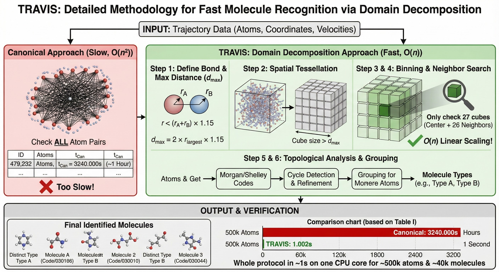

TRAVIS는 입력 궤적에서 원자 레이블, 위치, 그리고 선택적으로 속도만 읽습니다; 위상 정보(분자, 결합 등)는 무시됩니다. 대신, 거리 기반 결합 감지가 하나의 궤적 프레임에서 실행되며, 분자는 감지된 공유 결합을 기반으로 정의됩니다. 두 원자 사이의 거리가 두 원자 유형의 공유 반경(문헌[12]에서 가져옴)의 합에 열 진동을 고려한 상수(기본값 1.15, 변경 가능)를 곱한 값보다 작으면 공유 결합된 것으로 정의됩니다. 결합을 감지하기 위해 시스템 내 모든 원자 쌍의 거리를 확인하는 단순한("canonical") 접근 방식은 계산 시간 규모가 $O(n^2)$이므로 매우 비효율적입니다. TRAVIS는 공간 도메인 분해(spatial domain decomposition)에 기반한 더 정교한 접근 방식을 사용합니다. 도메인 분해 및 링크드 리스트 방법(linked list method)[13]과 같은 유사한 접근 방식은 계산 화학(특히 LAMMPS[5] 및 Gromacs[14]와 같은 병렬화된 힘장 분자 동역학 코드)에서 일반적으로 사용되지만, 궤적 후처리에는 거의 적용되지 않았습니다. 먼저, 시스템에서 가장 큰 공유 반경을 가진 원소를 찾고 이 반경의 두 배에 위에서 언급한 상수를 곱하여 가장 긴 가능한 결합 거리를 결정합니다. 그런 다음 시뮬레이션 셀은 동일한 크기와 모양의 큐브(cube)들로 테셀레이션(tessellation)됩니다. 각 셀 벡터를 따라 큐브의 수는 큐브의 모서리 길이가 가장 긴 가능한 결합 거리보다 커야 한다는 제약 조건을 만족하면서 가능한 한 크게 선택됩니다. 시스템의 모든 원자는 이 큐브들에 비닝(binned)됩니다. 큐브 내부의 특정 원자의 모든 공유 결합 파트너를 찾기 위해서는 동일한 큐브 및 26개의 이웃 큐브 내의 원자만 고려하면 됩니다. 이는 본질적으로 $O(n)$으로 확장되는 매우 빠른 결합 감지 알고리즘을 산출합니다.

> 공간 도메인 분해(spatial domain decomposition)는 3차원 시뮬레이션 공간(시뮬레이션 셀)을 **작은 공간 블록(보통 동일 크기의 큐브/직육면체 셀)** 으로 쪼개고, 각 원자를 “자기가 속한 블록”에 **비닝(binning)** 해 둔 다음, 어떤 원자의 이웃(예: 결합 가능 파트너, 비공유 상호작용 이웃)을 찾을 때 **전체 원자와의 거리 계산을 하지 않고** 그 원자가 들어있는 블록과 **인접 블록들만** 검사하도록 만드는 계산 기법입니다. 이렇게 하면 원자 쌍을 전부 비교하는 정석적 방식이 (O(N^2))로 커지는 것과 달리, 상호작용/결합의 최대 탐색거리(컷오프)가 정해져 있을 때는 “각 원자가 살펴봐야 할 후보가 근처에만 한정”되므로 전체 연산이 대체로 (O(N))에 가깝게 확장됩니다. TRAVIS 문맥에서는 (1) 가능한 **최대 결합 거리**를 먼저 정하고(원소 공유반경 합 × 여유계수), (2) 그 거리보다 **큰 모서리 길이**를 갖도록 셀을 큐브로 테셀레이션한 뒤, (3) 원자들을 큐브에 넣고, (4) 어떤 원자의 결합 파트너 탐색을 **자기 큐브 + 26개 이웃 큐브(3×3×3)** 로 제한함으로써 결합 감지의 후보 쌍 수를 급격히 줄입니다. 이 방식은 LAMMPS/GROMACS 같은 MD 코드에서 “이웃 리스트(linked list/Verlet list) 생성”의 기본 아이디어와 동일하며, 큰 시스템에서 분자 인식(결합 감지)을 수 초 내로 끝낼 수 있게 만드는 핵심 최적화입니다.

이 접근 방식의 효율성은 **Table I**에서 쉽게 확인할 수 있습니다. 여기서는 이온성 액체 [EMIm][OAc](즉, 1-ethyl-3-methylimidazolium acetate)의 이온 쌍을 포함하는 유사한 시스템(크기 증가)에 대한 분자 인식 시간을 보여줍니다. 네 번째 열은 정석적인(canonical) 알고리즘을 사용한 분자 인식 시간을 제공하는 반면, 다섯 번째 열은 도메인 분해 접근 방식의 타이밍을 묘사합니다. 비교적 작은 시스템의 경우 두 방법 모두 허용 가능합니다. 그러나 약 500,000개의 원자를 가진 시스템의 경우,

**TABLE I.** 정석적인 구현($t_{\text{Can}}$)과 도메인 분해 구현($t_{\text{Dom}}$)을 사용한 다양한 시스템 크기에 대한 분자 인식 실행 시간. 스냅샷은 이온성 액체 [EMIm][OAc]의 이온 쌍을 포함합니다.

| Ion pairs | Atoms | Cell (nm) | $t_{\text{Can}}$ (s) | $t_{\text{Dom}}$ (s) |
|---|---|---|---|---|
| 36 | 936 | 2.121 | 0.003 | 0.001 |
| 288 | 7 488 | 4.242 | 1.036 | 0.001 |
| 2 304 | 59 904 | 8.485 | 83.009 | 0.011 |
| 18 432 | 479 232 | 16.969 | 3240.000 | 1.002 |

<!-- Page 4 -->

17 nm 입방 셀에서 정석적인 접근 방식은 분자 인식에 거의 1시간이 걸리는 반면, 도메인 분해 기반 구현은 단 1초 만에 실행됩니다.

분자 인식 후, Morgan 알고리즘[16]의 Shelley 확장[15]을 사용하여 원자에 위상 원자 코드(topological atom codes)가 할당됩니다. 이 알고리즘은 위상적으로 동등한 원자에는 동일한 코드를, 그렇지 않은 경우에는 다른 코드를 제공하도록 보장합니다. 원자 번호는 내림차순 원자 코드에 따라 할당됩니다. 부산물로서 TRAVIS는 위상적으로 동일한 원자 목록을 유지하며, 이는 많은 분석에 유용합니다. 또한, 일부 분석은 고리형 구조에 적합하므로 전체 고리 시스템 감지 및 정제[17]가 수행됩니다. 마지막으로, 동일한 원자 코드 세트를 가진 모든 개별 분자는 위상적으로 동등한 것으로 간주되어 분자 유형(molecule types)으로 그룹화됩니다. **Table I**에 표시된 것처럼 약 500,000개의 원자와 40,000개의 분자가 있는 시스템에 대해 이 전체 프로토콜이 하나의 CPU 코어에서 단 1초밖에 걸리지 않는다는 점을 다시 한번 지적하고 싶습니다.

### B. BQB 형식—궤적 및 체적 데이터의 무손실 압축 (The BQB format—Lossless compression of trajectories and volumetric data)

2018년에 우리는 체적 데이터 궤적의 고효율 무손실 압축을 위한 접근 방식을 개발하고 발표했으며[7], 압축된 데이터를 저장하기 위해 BQB 파일 형식을 도입했습니다("무손실"은 실제로 입력 Gaussian Cube 파일이 비트 단위로 재현됨을 의미합니다). 진동 스펙트럼을 계산하기 위한 TRAVIS의 방법(아래 참조)은 궤적을 따라 그리드상의 총 전자 밀도를 필요로 하며, 이는 쉽게 수 테라바이트의 원시 데이터에 달할 수 있습니다. 우리의 새로운 압축 체계를 사용하면 정보를 잃지 않고 이 데이터를 크게 압축할 수 있습니다. **Figure 1**은 방법의 성능에 대한 몇 가지 세부 정보를 제공합니다. bzip2 및 xz와 같은 다목적 압축 도구는 데이터의 특정 구조(공간과 시간 모두에서의 매끄러움)를 활용하지 못하고 약 5:1의 압축률에 도달하는 반면, BQB 형식은 압축 및 압축 해제 시간에서 앞의 두 방법보다 빠르면서도 약 40:1의 무손실 압축률을 산출합니다. 또한 BQB 형식은 프레임에 대한 임의 접근(random access)을 허용하는데,
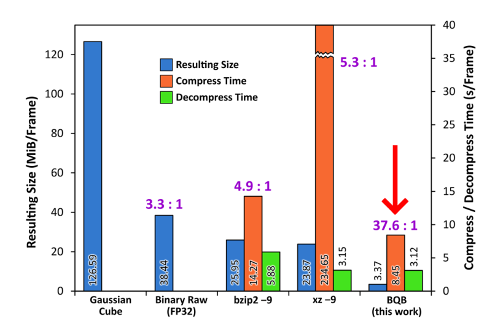

**FIG. 1.** 다양한 무손실 압축 알고리즘을 사용한 체적 전자 밀도 프레임의 압축 시간(주황색), 압축 해제 시간(녹색), 압축된 크기(파란색). 여기서 논의된 BQB 형식[7]은 오른쪽에 표시되어 있습니다.

이는 물론 다목적 압축 형식의 경우에는 해당되지 않습니다. 높은 압축 효율은 다차원 다항식 외삽, 힐버트 곡선 재정렬, 정석적인 다중 테이블 허프만 인코딩을 포함한 일련의 방법을 적용하여 달성됩니다[7].

우리의 원래 목표는 체적 데이터 궤적을 압축하는 것이었지만, 동일한 방법론이 표준 위치 궤적도 무손실로 압축할 수 있다는 점에 주목했습니다. 0.5 fs의 프레임 간격을 가진 XYZ 궤적 파일에서 시작할 때, BQB 형식은 여기서 약 20:1의 압축률에 도달합니다. 이는 정확도를 희생하지 않으면서 DCD나 Gromacs XTC[14]와 같은 다른 기존 궤적 형식보다 훨씬 효율적입니다. 자세한 내용은 참고문헌 [7]에서 찾을 수 있습니다.

BQB 형식과 위에서 설명한 방법은 TRAVIS에 구현되어 있으며, 체적 또는 위치 궤적을 압축 또는 압축 해제하거나 이러한 궤적을 직접 읽고 분석하는 데 사용할 수 있습니다. 그 외에도 "bqbtool"이라는 궤적 압축 및 압축 해제를 위한 독립형 도구가 있습니다. 다른 프로그램 패키지에 BQB 형식 지원을 추가하기 위한 라이브러리("libbqb")가 곧 출시될 예정입니다. 자세한 내용은 BQB 형식 웹사이트[18]를 참조하십시오.

## III. 구조적 분석 (STRUCTURAL ANALYSES)

이 섹션에서는 TRAVIS에 구현된 몇 가지 구조적 분석을 제시합니다. 위에서 언급했듯이 구조적 분석은 이 문맥에서 궤적 프레임의 재배열에 불변인 분석으로 정의됩니다. 이 속성 때문에 구조적 분석은 궤적을 따라 물리적 시간이 흐를 필요가 없으므로 몬테카를로 시뮬레이션에도 적용할 수 있습니다.

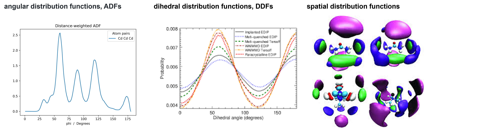

### A. 입자 밀도 히스토그램 (Particle density histograms)

아마도 가장 일반적인 종류의 궤적 분석은 입자 밀도 히스토그램일 것입니다. 특히, $g(r)$로도 알려진 **동경 분포 함수(radial distribution function, RDF)**는 액체상 시뮬레이션 주제에 관한 수많은 출판물에서 발견됩니다. 이것은 또한 TRAVIS에 구현된 최초의 분석 중 하나였습니다. RDF 자체 외에도 TRAVIS는 해당 수 적분(number integral) 곡선을 출력하여, 예를 들어 첫 번째 용매화 껍질 내의 분자 수를 쉽게 결정할 수 있습니다. 최근에는 RDF의 첫 번째 최대값과 첫 번째 최소값을 자동으로 인식하고, 첫 번째 껍질 내에서 발견된 입자 수와 함께 이 두 지점의 거리 및 강도를 로그 파일에 출력하는 기능을 추가했습니다. 이는 많은 다른 궤적을 평가하는 경우 배치 처리에 유용합니다. 또 다른 최근 추가 사항은 셀 직경의 절반보다 큰 거리까지 RDF를 계산하는 알고리즘[19]으로, 이는 컴퓨터 시간을 절약할 수 있습니다. TRAVIS로 계산된 RDF는 수 적분 및 배위수(coordination numbers)를 포함하여 문헌[20–32, 33–38]에 여러 번 등장했습니다.

RDF 외에도 TRAVIS는 각도 및 이면각(dihedral angles)을 포함하는 다른 1차원 입자 밀도 히스토그램을 생성할 수 있습니다. 해당 함수는 각각 **각도 분포 함수(angular distribution functions, ADFs)** 및 **이면각 분포 함수(dihedral distribution functions, DDFs)**라고 합니다. 또한 점과 선 사이의 거리를 모니터링할 수 있으며, 여기서 점은 일부 분자의 임의의 원자가 될 수 있고 선은 다른 두 원자에 의해 정의될 수 있습니다.

<!-- Page 5 -->

동일하거나 다른 분자에 있을 수 있습니다. 해당 분석은 **점-선 분포 함수(point–line distribution function, LiDF)**라고 합니다. 유사하게, 점과 평면 사이의 거리를 관찰할 수 있으며, 여기서 평면은 일부 분자의 세 점에 의해 정의되거나 기준점과 법선 벡터를 지정하여 정의될 수 있습니다. 이 분석은 **점-평면 분포 함수(point–plane distribution function, PlDF)**라고 합니다. 이 모든 함수에 대해 개별 쌍의 시간적 전개도 관찰할 수 있습니다. RDF의 경우, 예를 들어 선택된(또는 모든) 쌍 거리를 시뮬레이션 시간에 대해 플롯한 결과를 산출합니다.

시뮬레이션이 열적 평형 상태가 아닌 경우, 일부 히스토그램은 시뮬레이션 시간에 따라 변경될 수 있습니다. TRAVIS는 한 축에는 히스토그램 양을, 다른 축에는 시뮬레이션 시간을 둔 2D 등고선 플롯(contour plot)을 생성하는 기능을 제공합니다. 우리가 시간 의존 분포 함수(TDDF)라고 부르는 이 분석은 시뮬레이션 중에 일부 과정(상 분리 또는 결정화)이 발생하는지 조사합니다. 현재 TDDF에는 RDF만 지원되지만 다른 양들도 곧 구현될 예정입니다.

자주 사용되는 또 다른 입자 밀도 히스토그램 클래스는 **공간 분포 함수(spatial distribution functions, SDFs)**입니다. 여기서 기준 분자는 분자의 세 점을 기반으로 로컬 좌표계를 정의하여 고정됩니다. 그 후, 고정된 기준 분자 주위의 다른 분자의 평균 입자 밀도가 계산됩니다. 결과 입자 밀도는 체적 데이터셋이므로 이 데이터의 등가면(iso-surfaces)만 시각화할 수 있습니다. TRAVIS는 결과 체적 데이터를 입자 밀도($\text{nm}^{-3}$)로 출력하거나 RDF와 유사하게 균일 밀도에 상대적인 값으로 출력하는 기능을 제공합니다. 또한 SDF 평활화(smoothing), SDF 반전, 절단면 생성, 샘플링 개선을 위해 특정 평면에 대해 SDF를 대칭으로 강제하는 것과 같은 몇 가지 고급 기능이 구현되어 있습니다. TRAVIS에 의해 계산된 SDF가 문헌에 발표된 많은 예가 있습니다[20,21,24,25,32,39–48].

시뮬레이션 셀이 비등방성인 경우(예: 표면 또는 지질 이중층이 있는 시스템), 시뮬레이션 셀의 고정 벡터를 따라 **밀도 프로파일(density profiles, DProf)**을 계산하는 것이 흥미로울 수 있습니다. 결과는 선택된 벡터에 수직인 시스템의 얇은 슬라이스에서 선택된 입자 유형의 입자 밀도($\text{nm}^{-3}$ 또는 균일 밀도에 상대적)를 제공하는 히스토그램입니다. TRAVIS로 계산된 밀도 프로파일은 이미 발표되었습니다[29,49,50].

최근에 우리는 궤적을 따라 기하학적 영역 내의 평균 입자 밀도의 시간적 발전을 관찰하기 위해 **기하학적 밀도 분석(geometric density analysis, GeoDens)**이라는 기능을 구현했습니다. 특정 응용 사례에서 우리는 염다리(salt bridge)에 관여하는 두 아미노산 분자 사이에 실린더를 정의했습니다[31]. 실린더는 고정된 반경을 갖지만, 시작점과 끝점은 분자에 묶여 있어 실린더가 분자와 함께 움직입니다. 균일 밀도에 상대적인 이 실린더 내 음이온의 입자 밀도를 모니터링함으로써, 우리는 음이온이 염다리에서 밀려난다는 결론을 내릴 수 있었습니다(참고문헌 31의 Fig. S-18 참조).

### B. 결합 분포 함수 (Combined distribution functions)

두 관측량이 상관관계가 있는 경우, 관측량의 개별 히스토그램은 상황에 대한 완전한 그림을 제공하지 않으며 상관 효과를 이해하기 위해 다차원 히스토그램이 필요합니다(예: **Figure 2** 참조). 액체상 궤적 내에서[23,24], 특정 수소 결합의 길이는 가로축에 묘사되고 수소 결합 각도는 세로축에 표시됩니다. 2D 등고선 플롯은 매우 강한 신호를 가지고 있으며,

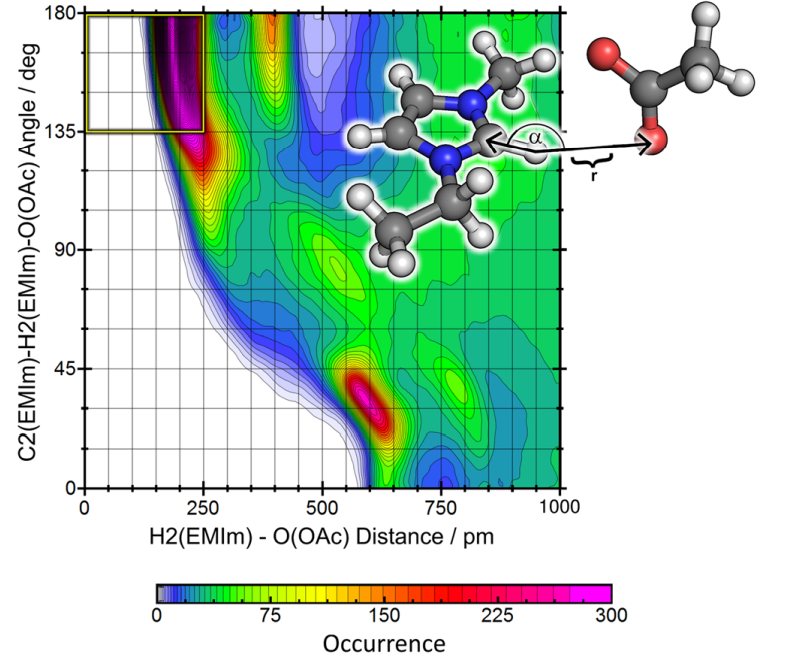

**FIG. 2.** 이온성 액체 [EMIm][OAc]에서 O···H 거리와 O···H–C 각도를 묘사하는 결합 분포 함수(CDF)[23,24]. 가능한 기하학적 수소 결합 기준이 노란색 직사각형으로 표시되어 있습니다.

낮은 거리와 180° 주변의 각도에서 수소 결합을 나타냅니다. 플롯은 짧은 거리에서 각도가 우선적으로 180°에 가깝다는 정보를 제공합니다. 이것은 두 양 사이의 상관관계이며, 표준 1D 히스토그램은 이 정보를 제공할 수 없습니다.

TRAVIS는 다수의 스칼라 양을 다차원 히스토그램으로 결합하며, 이를 여기서는 **결합 분포 함수(combined distribution functions, CDFs)**라고 부릅니다. 거리, 각도, 이면각, 점-평면 거리, 점-선 거리의 조합을 사용하여 단일 궤적에서 수천 개의 흥미로운 CDF를 계산할 수 있습니다. 문헌에는 TRAVIS로 계산된 CDF의 많은 예가 있습니다[21–26,30,33,37,40–42,46,51–54]. TRAVIS에서는 세 가지 스칼라 양을 3차원 히스토그램으로 결합하는 것도 지원됩니다. 결과 히스토그램은 문헌에서 몇 번 보여진 것처럼 등가면을 통해 시각화할 수 있습니다[24,33,55].

양들 사이의 상관관계를 이해하는 훨씬 더 직접적인 방법은 TRAVIS의 소위 **상관 플롯(correlation plot)**입니다. **Figure 3**의 왼쪽 패널에 두 거리가 있는 CDF가 표시된 것을 고려하십시오. 가로축은 벌크 상 시뮬레이션 내 아세테이트 음이온의 C–O 결합 길이를 묘사하고[23,24], 세로축은 동일한 아세테이트 음이온의 다른 C–O 결합 길이를 보여줍니다. 두 양이 상관관계가 없다면, 2D 히스토그램은 단순히 두 1D 결합 길이 히스토그램의 데카르트 곱(Cartesian product)이 될 것입니다. 상관관계를 드러내기 위해 TRAVIS는 내부적으로 두 히스토그램의 데카르트 곱을 생성하고 실제 CDF에서 뺍니다. 결과 상관 플롯은 **Figure 3**의 오른쪽 패널에 표시됩니다. 양수 값은 두 양이 상관관계가 없는 경우보다 이 구성을 찾을 확률이 더 크다는 것을 나타내며(즉, 양의 상관관계), 음수 값은 상관관계가 없는 경우보다 덜 가능한 상황을 묘사합니다(음의 상관관계). 우리는 하나는 길어지고 하나는 짧아진 결합을 가진 구성이

<!-- Page 6 -->

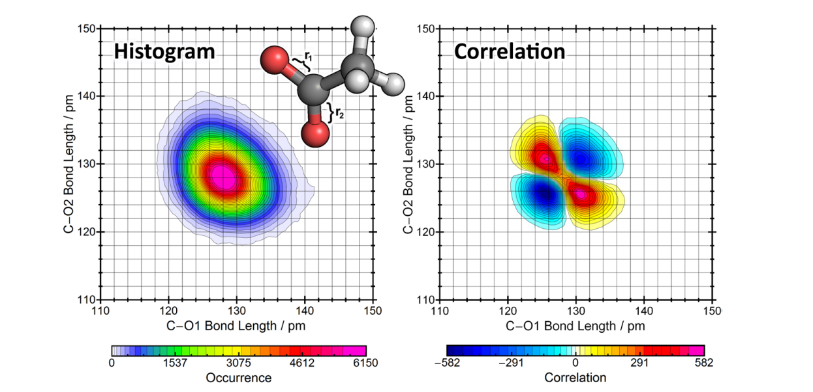

**FIG. 3.** [EMIm][OAc]의 아세테이트 음이온에서 두 C–O 결합 길이의 2차원 히스토그램(왼쪽 패널)[23,24]; 두 양에 대한 상관 플롯은 유의미한 상관관계를 드러냅니다(오른쪽 패널).

개별 결합 길이 통계에서 예상되는 것보다 더 가능성이 높은 반면, 두 결합이 모두 길거나 짧은 경우는 덜 가능성이 있음을 발견했습니다—명확한 상관 효과입니다.

### C. 구조 인자 (Structure factors)

응집상 시스템에 대한 매우 중요한 실험 기술은 $S(\mathbf{q})$라고도 불리는 구조 인자를 측정하는 것입니다. 구조 인자는 푸리에 변환에 의해 시스템의 $g(r)$과 관련됩니다.

$$ S(\mathbf{q}) = 1 + \rho \int e^{-i\mathbf{qr}} (g(r) - 1) \, d\mathbf{r}. \quad (1) $$

이 쉬운 관계에도 불구하고, 시뮬레이션 궤적에서 $S(\mathbf{q})$를 계산하는 것은 약간 더 복잡합니다. 모든 원자 쌍이 이에 기여하므로 시스템의 가능한 모든 쌍별 RDF를 계산하고, 해당 원소 유형의 산란 단면적(scattering cross sections)으로 올바르게 가중치를 부여한 다음, 최종적으로 합산해야 하기 때문입니다. TRAVIS는 이를 자동으로 수행하고 총 $S(\mathbf{q})$를 모든 부분 구조 인자(즉, 특정 원소 쌍의 총 구조 인자에 대한 기여)와 함께 직접 출력합니다[27]. 일반적으로 사용되는 몇 가지 정규화 인자를 사용할 수 있습니다. 또한 구조 인자에 대한 개별 분자 내(intramolecular) 및 분자 간(intermolecular) 기여를 계산할 수 있습니다. 가장 중요한 동위원소에 대한 중성자 산란 단면적[56]과 X선 산란 단면적(Cromer–Mann 계수로 주어짐)이 TRAVIS에 포함되어 있어 중성자 및 X선 구조 인자를 모두 계산할 수 있습니다[27]. 최근에는 구조 인자 계산에 Lorch 유형 윈도우 함수[57]를 적용하는 옵션이 구현되었습니다. TRAVIS로 계산된 구조 인자는 문헌에 여러 번 발표되었습니다[27,52,55,58–62]. TRAVIS는 또한 동적 구조 인자 $S(\mathbf{q}, \omega)$를 계산할 수 있으며, 이는 섹션 IV E에서 논의됩니다.

### D. 질서 매개변수 (Order parameters)

교란되거나 정렬된 구조를 결정하기 위한 소위 질서 매개변수(order parameters)는 매우 다양합니다. TRAVIS는 우리가 시뮬레이션해 온 지질 이중층을 특성화하는 데 적합한 몇 가지만 포함하고 있습니다[29]. 첫 번째는 **꼬리 벡터 기울기 분석(tail vector tilting analysis)**입니다. 지질 이중층이 졸(sol) 상에 있는 경우, 지방산 꼬리 벡터는 무작위 방향으로 배향되어 끊임없이 변동합니다. 그러나 이중층이 겔(gel) 상으로 전이되면 꼬리 벡터는 모두 같은 방향으로 같은 각도로 기울어집니다. 모든 꼬리 벡터를 X-Y 평면(여기서 Z 방향은 이중층의 법선 벡터)에 투영함으로써 이중층이 졸 상태인지 겔 상태인지 쉽게 확인할 수 있습니다(참고문헌 29의 Fig. 3 참조).

TRAVIS에 구현된 두 번째 질서 매개변수는 $S_{CD}$로, 중수소 질서 매개변수라고도 불리며, 중수소화된 샘플의 핵자기공명(NMR) 실험으로 직접 측정할 수 있습니다[63,64]. 다음 식에 의해 계산됩니다:

$$ S_{CD}^k = \frac{1}{NT} \sum_{i=1}^{N} \sum_{t=1}^{T} \frac{3}{2} \cos^2 (\measuredangle (\mathbf{r}_{ik}^{\text{C–H}}(t), \mathbf{n})) - \frac{1}{2}, \quad (2) $$

여기서 $k$는 알킬 사슬의 위치를 나타내고, $N$은 지질 분자의 수, $T$는 총 시간 단계 수, $\mathbf{r}_{ik}^{\text{C–H}}(t)$는 시간 단계 $t$에서 사슬의 $k$번째 탄소 원자의 C–H(또는 C–D) 결합 벡터 중 하나이며, $\mathbf{n}$은 막 법선 벡터입니다. $S_{CD}$는 -0.5와 1 사이의 값을 가질 수 있으며, 여기서 0은 통계적 분포(즉, 질서 없음)에 해당하고 -0.5는 결합 벡터가 엄격하게 막 평면 내에 있음을 나타냅니다. 이 분석의 적용 예는 참고문헌 29의 Fig. 4에서 찾을 수 있습니다.

마지막으로, 우리는 알킬 사슬을 따라 *gauche* 비율, 즉 주어진 사슬 위치에서 C–C–C–C 이면각이 60°에 가까운 평균 비율을 계산하는 기능을 구현했습니다. 이를 *gauche* 구성이라고 합니다. 이 구성은 이면각이 약 180°인 *anti* 구성보다 에너지적으로 덜 유리하므로 통계적으로 덜 분포합니다. 이 분석의 적용 및 결과 해석에 대해서는 참고문헌 29의 Fig. 5와 Table 2를 참조하십시오.

<!-- Page 7 -->

### E. 용매 배향 (Solvent orientation)

용액의 응집상 시뮬레이션에서 용매 분자가 용질 주위에 어떻게 배열되고 배향되는지 이해하는 것은 종종 매우 흥미롭습니다. 용매 껍질에 대한 정보는 RDF와 SDF에서 얻을 수 있지만, 개별 용매 분자의 배향에 대한 세부 정보는 이러한 분석에서 얻을 수 없습니다. 거리와 각도를 포함하는 CDF는 용매 배향에 대한 정보를 줄 수 있지만, 용질 분자 주위의 특정 위치에서 선호되는 용매 배향이 무엇인지는 여전히 명확하지 않습니다. 이를 극복하기 위해 우리는 **평면 투영 분석(plane projection analysis, PlProj)**을 구현했습니다. 물 속의 [EMIm][OAc] 이온 쌍 하나를 시뮬레이션한 **Figure 4**를 고려해 보십시오. 여기서 [EMIm]$^+$ 양이온은 고정되어 있습니다. 플롯의 색상 스케일은 균일 밀도에 상대적인 주어진 위치에서의 물의 평균 입자 밀도를 묘사합니다([EMIm]$^+$ 고리 평면에 의해 정의된 시뮬레이션 셀의 얇은 슬라이스만 고려). 1보다 큰 값은 물이 임의의 위치보다 이곳에서 더 자주 발견됨을 의미하며, 1 미만의 값은 해당 지점에서 물 분자의 고갈을 나타냅니다. 입자 밀도가 1 미만인 명확한 고갈 영역에 의해 물 벌크 상과 분리된, 입자 밀도가 1 이상인 잘 정의된 첫 번째 용매화 층이 존재함을 알 수 있습니다. 플롯의 벡터는 각 지점에서 물 쌍극자 벡터의 평균 배향을 묘사합니다. 예상대로 물은 세 개의 양성자성 고리 수소 원자와 수소 결합을 형성하므로 물 쌍극자 벡터는 평균적으로 이 원자들로부터 멀어지는 방향을 가리키는 것을 볼 수 있습니다. 분자의 비극성 영역 옆에는 물 분자의 명확한 선호 배향이 없어 평균 벡터가 매우 짧습니다.

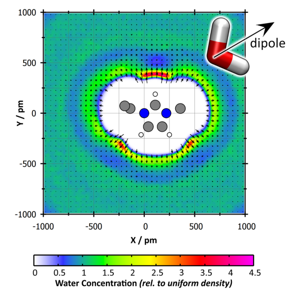

**FIG. 4.** 물 속의 [EMIm][OAc] 이온 쌍 하나를 시뮬레이션한 결과에서 [EMIm]$^+$ 양이온 주위의 물 분자의 평균 입자 밀도(색상 스케일)와 물 쌍극자 벡터의 평균 배향(화살표).
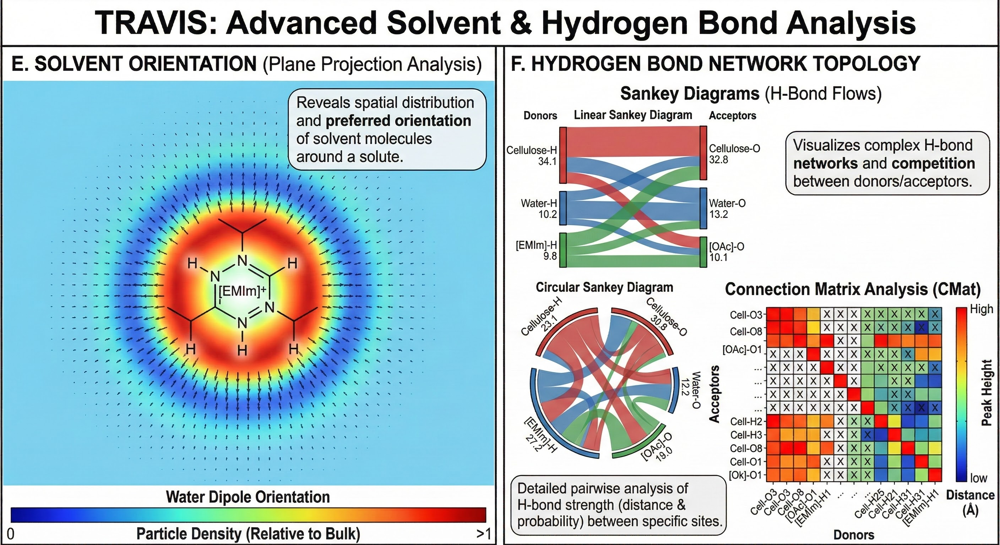

### F. 수소 결합 네트워크 토폴로지 (Hydrogen bond network topology)

많은 분자 액체는 수소 결합을 형성하며, 이는 종종 특성에 상당한 영향을 미칩니다(물을 생각해 보십시오). 복잡한 시스템에 여러 다른 수소 결합 공여체(donor)와 수용체(acceptor)가 있는 경우 상호 작용의 미묘한 균형이 발견되며, 수소 결합 공여체 또는 수용체 강도의 작은 변화조차도 큰 효과로 이어질 수 있습니다. 따라서 이러한 시스템에서 수소 결합 토폴로지와 공여체/수용체 위치에 대한 경쟁을 이해하는 것은 매우 중요합니다. 수소 결합의 강도에 대한 간단한 추정치는 X···H RDF에서 첫 번째 최대값의 거리와 높이, 그리고 첫 번째 최소값까지의 수 적분(원자 X의 평균 수소 결합 수를 제공함)입니다. 셀룰로오스 올리고머가 이온성 액체 [EMIm][OAc]와 물의 혼합물에 용해된 시스템을 고려해 봅시다. 세 가지 수소 결합 공여체(셀룰로오스 알코올 H, 물 H, [EMIm]$^+$ 고리 양성자)와 세 가지 수용체(셀룰로오스 O, 물 O, [OAc]$^-$ O)가 있습니다. 쌍별 RDF로부터의 수소 결합 추정치는 숫자 행렬로 작성될 수 있지만, 이는 매우 예시적이지 않습니다. 최근에 우리는 생키(Sankey) 다이어그램에 기반하여 이러한 데이터를 나타내는 훨씬 더 매력적인 방법을 찾았습니다[65]. 이 개념은 이제 120년 이상 되었지만 계산 화학에서는 거의 발견되지 않으며 우리가 아는 한 수소 결합 토폴로지를 시각화하는 데 사용된 적이 없습니다. 따라서 초기 기원에도 불구하고 우리는 이것을 "현대적인" 시각화 기술로 간주합니다. MatPlotLib[66]과 같은 일부 일반적인 플로팅 라이브러리는 생키 다이어그램을 생성할 수 있지만 아래 설명된 원형 변형은 생성할 수 없습니다. 위에서 설명한 혼합물의 수소 결합 토폴로지 시각화는 **Figure 5**를 참조하십시오. 왼쪽 패널에는 **선형 생키 다이어그램(linear Sankey diagram)**이 표시되어 있으며, 왼쪽에는 수소 결합 공여체가, 오른쪽에는 수용체가 포함되어 있습니다. 숫자는 공여체/수용체의 평균 수소 결합 수에 해당합니다. 연결 막대의 너비는 수소 결합 수에 비례합니다. 왼쪽에서 오른쪽으로 막대 너비의 변화는 서로 다른 분자 수에서 발생한다는 점에 유의하십시오. **Figure 5**의 오른쪽 패널에는 동일한 데이터가 **원형 생키 다이어그램(circular Sankey diagram)**으로 시각화되어 있습니다. 다시 말하지만, 숫자는 공여체/수용체의 총 수소 결합 수를 나타내며 연결 너비는 두 연결된 그룹의 수소 결합 수에 비례합니다. 우리는 생키 다이어그램이 그러한 토폴로지를 나타내는 매우 예시적이고 명확한 도구라고 믿으며, 앞으로 많은 계산 화학 논문에서 볼 수 있기를 바랍니다. 표시된 대로 선형 및 원형 생키 다이어그램을 모두 생성할 수 있는 일반적인 플로팅 프로그램이 없으므로 TRAVIS는 이미지를 SVG 벡터 그래픽으로 직접 출력합니다.

훨씬 더 세밀한 분석이 필요한 경우를 위해 우리는 수십 개의 수소 결합 공여체와 수용체 사이의 수소 결합 패턴을 드러내는 또 다른 분석을 개발했습니다. 예를 들어, 셀룰로오스 펜타머의 16개 산소 원자 중 어느 것이 어떤 수용체와 수소 결합을 형성하는지 관심이 있다면, 이 분석은 원하는 결과로 가는 지름길을 제공할 것입니다. 여기서는 물 없이 셀룰로오스와 [EMIm][OAc]만 있는 시스템을 고려합니다(**Figure 6** 참조). 우리는 이 분석을 **연결 행렬 분석(connection matrix analysis, CMat)**이라고 부릅니다. 왼쪽의 행렬 행은 시스템의 모든 다른 수소 결합 수용체에 해당하고 열은 다른 수소 결합 공여체를 나타냅니다. 각 행렬 요소에 대해 TRAVIS는 내부적으로 RDF를 계산하고 첫 번째의 거리와 높이를 추출합니다.

<!-- Page 8 -->

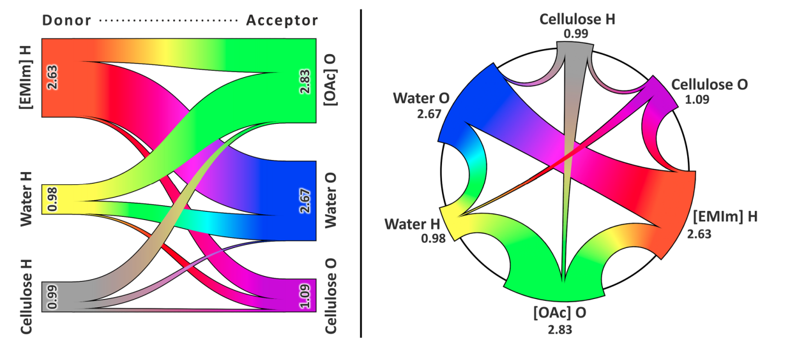

**FIG. 5.** [EMIm][OAc]와 물의 혼합물에 용해된 셀룰로오스의 수소 결합 토폴로지를 나타내는 선형 생키 다이어그램(왼쪽). 동일한 데이터셋을 묘사하는 원형 생키 다이어그램(오른쪽), 둘 다 TRAVIS에 의해 생성되었습니다. 숫자는 공여체/수용체당 평균 수소 결합 수에 해당합니다.

최대값. RDF가 수소 결합의 존재를 나타내지 않으면 행렬 요소는 단순히 검은색 십자가로 채워집니다. 수소 결합이 존재하는 경우 사각형은 **Figure 6**의 오른쪽에 표시된 2차원 색상 스케일에 따라 색상으로 채워집니다. 첫 번째 RDF 최대값의 거리와 높이 모두 색상으로 인코딩됩니다. 예를 들어 빨간색은 매우 작은 거리와 매우 큰 최대 높이를 가진 수소 결합(즉, *매우 강한 수소 결합*)을 나타냅니다. 반면 노란색은 최대 높이는 크지만 거리가 큰 수소 결합에 해당하므로 매우 강한 것으로 간주되지 않습니다. 행렬을 보면 아세테이트 음이온이 많은 공여체와 강한 수소 결합을 형성하는 반면, 많은 셀룰로오스 산소 원자는 강한 수소 결합에 관여하지 않는다는 것을 즉시 알 수 있습니다. 셀룰로오스에는 두 개의 강한 분자 내 수소 결합, 즉 O3···H25 및 O8···H31이 명확하게 보입니다. 표준 RDF 분석만으로 이 정보를 얻으려면 수백 개의 RDF를 계산하고 수동으로 살펴봐야 했을 것입니다. 우리는 연결 행렬 분석이 그 과정을 크게 단순화한다고 확신합니다.

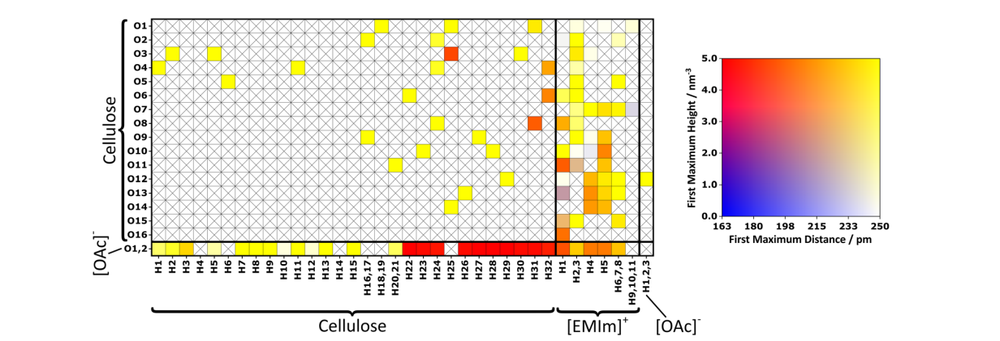

**FIG. 6.** [EMIm][OAc]에 용해된 셀룰로오스의 연결 행렬 분석[32]. 행은 수소 결합 수용체를 나타내고 열은 수소 결합 공여체를 나타냅니다. 각 사각형의 색상은 해당 RDF의 첫 번째 최대값의 강도와 거리를 모두 나타냅니다(색상 스케일은 오른쪽 참조).

<!-- Page 9 -->

### G. 보로노이 분석 (Voronoi analysis)

> **보로노이 테셀레이션(Voronoi Tessellation) 요약**
>
> 보로노이 테셀레이션은 공간 내의 특정 점(원자)을 기준으로 **"어떤 점이 가장 가까운가"**에 따라 공간을 나누는 수학적 형식입니다. 각 원자를 중심으로 삼아, 다른 어떤 원자보다 해당 원자에 더 가까운 지점들을 모두 모으면 하나의 '보로노이 셀'이라는 독립된 영역이 만들어집니다.
>
>
>
> 이 방식은 화학 시뮬레이션에서 매우 중요한 의미를 갖습니다. 첫째, 원자가 차지하는 **부피와 표면적, 그리고 구형도(얼마나 구에 가까운지)**를 수학적으로 정확하게 측정할 수 있습니다. 둘째, 사람이 임의로 정하는 기준 없이 **"두 셀이 면을 공유하면 이웃이다"**라는 객관적이고 편향되지 않은 이웃 기준을 제공합니다.
>
> 결과적으로 TRAVIS와 같은 도구는 이 기법을 통해 복잡한 분자 시스템 내에서 원자들 사이의 연결성(이웃 확률)을 분석하고, 이를 3D 렌더링이나 통계 행렬로 시각화하여 물질의 구조적 특성을 파악하는 데 활용합니다.

110년 이상 되었음에도 불구하고 보로노이 테셀레이션(Voronoi tessellation)[67]은 여전히 매혹적인 수학적 형식입니다. 원자를 보로노이 사이트로 하는 시뮬레이션 셀에 적용하면, 간단히 말해서, 공간의 모든 지점이 다른 어떤 원자보다 특정 원자에 더 가까운 경우 해당 원자의 보로노이 셀에 할당되는 방식으로 상자를 각 원자에 속하는 보로노이 셀로 분할합니다. TRAVIS는 무료 Voro++ 라이브러리[68,69](외부에서 제공할 필요가 없도록 TRAVIS 소스 코드에 통합됨)를 사용하여 주기적 라디칼 보로노이 테셀레이션(periodic radical Voronoi tessellation)[70,71]을 수행합니다. 이러한 테셀레이션으로부터 많은 흥미로운 속성을 도출할 수 있습니다. 한편으로는 Povray[10]를 통한 3D 렌더링으로 보로노이 셀을 직접 시각화할 수 있습니다. 다른 한편으로는 보로노이 셀의 부피, 표면적, 등주 지수(isoperimetric quotients, 셀의 "구형도" 척도) 등에 대한 통계를 생성할 수 있습니다. 또한 보로노이 표면 커버리지(Voronoi surface coverage), 즉 분자의 보로노이 셀 면 중 몇 퍼센트가 특정 유형의 다른 분자와 공유되는지 모니터링할 수 있습니다. 시각화와 통계 모두 TRAVIS로 수행할 수 있으며, 이는 이미 문헌[37,42,72,73]에서 입증되었습니다.

보로노이 테셀레이션의 또 다른 흥미로운 결과는 간단하고 편향되지 않은 이웃 기준입니다: 두 원자의 보로노이 셀이 공통 면을 공유하면 이 두 원자는 이웃이라고 합니다. RDF의 첫 번째 최소값을 기반으로 하는 것과 같은 다른 이웃 기준과 달리, 이 접근 방식은 경험적 매개변수를 가지고 있지 않기 때문에 큰 단순성을 통해 설득력이 있습니다. 따라서 편향되지 않은 기준이며 모든 종류의 시스템에 적용 가능합니다. **Figure 7**에서는 [EMIm][OAc]의 벌크 상 시뮬레이션[23,24]에서 모든 원자 쌍에 대한 이웃 확률이 행렬로 시각화되어 있습니다. 흰색은 이웃 확률 0에 해당합니다(즉, 이 두 원자는 공통 보로노이 면을 공유하지 않음). 반면 보라색은 이웃 확률 1을 나타냅니다(즉, 한 원자 유형은 항상 다른 유형의 원자와 적어도 하나의 공유 보로노이 면을 가짐). 아세테이트 사이의 강한 수소 결합

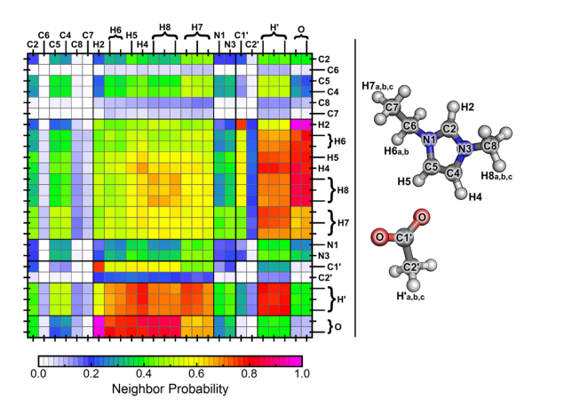

**FIG. 7.** 보로노이 분석의 이웃 확률 행렬. 각 사각형의 색상은 [EMIm][OAc] 시뮬레이션에서 행/열의 두 원자 유형이 한 번에 공통 보로노이 면을 공유할 확률을 묘사합니다.

산소 원자와 양성자성 고리 수소 원자는 직접 볼 수 있는 반면, 지방족 측쇄의 수소 원자 사이의 일부 상호 작용도 볼 수 있습니다. 이러한 이웃 행렬은 시스템의 전체 이웃 관계를 하나의 이미지에 포착하므로 액체 구조의 지문(fingerprint)으로 간주될 수 있습니다.

### H. 도메인 분석 (Domain analysis)

복잡한 액체 시스템에서 미세 불균일성(microheterogeneity)과 미세 상 분리(microphase separation)를 연구하기 위해 우리는 2015년에 보로노이 기반 **도메인 분석(DomA)**을 개발했습니다[28]. 먼저 시스템의 원자를 다른 클래스로 분류합니다. 예를 들어 극성, 비극성, 측쇄, 방향족, 불소화 등으로 분류할 수 있습니다. 그런 다음 시스템의 모든 원자를 보로노이 사이트로 사용하여 시뮬레이션 셀의 라디칼 보로노이 테셀레이션을 수행합니다. 이웃하는(즉, 공통 보로노이 면을 공유하는) 동일한 클래스의 원자들의 보로노이 셀은 병합됩니다. 이것은 다양한 크기와 모양의 도메인으로 이어집니다. 이 개념의 2차원 그림은 **Figure 8**에 제시되어 있으며, 여기서 다른 채우기 색상은 다른 원자 클래스를 나타내고 굵은 검은색 선은 도메인 경계에 해당합니다. 완벽하게 균질한 시스템에는 많은 작은 도메인이 있지만, 동일한 클래스의 원자가 클러스터를 형성하는 경향이 있기 때문에 일정 정도의 미세 불균일성은 더 적은 수의 더 큰 도메인으로 이어집니다. 모든 궤적 프레임에서 이 분석을 수행하고 도메인 통계(평균 도메인 수, 부피, 표면적, 등주 지수 등)를 살펴봄으로써 시스템의 미세 상 거동에 대한 많은 통찰력을 얻을 수 있습니다. 이것은 이미 문헌[27,60,73–78]에서 여러 번 성공적으로 적용되었습니다.

### I. 공극 분석 (Void analysis)

용액에서 용질의 배제 부피(exclusion volume)는 순수 액체의 구조를 교란합니다. 분명히, 이미 공극(void)이 존재한다면 이 교란에 필요한 에너지 양은 감소합니다.

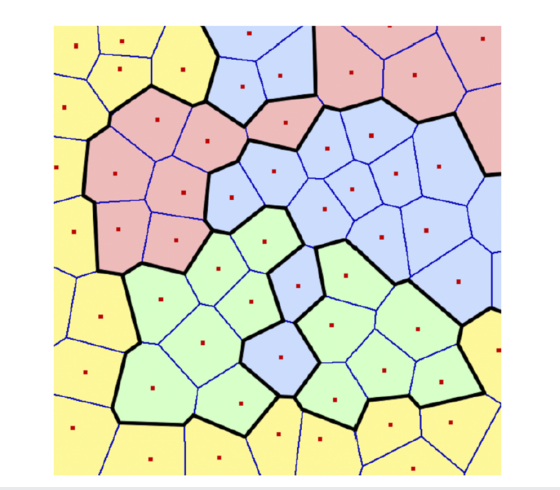

**FIG. 8.** 보로노이 기반 도메인 분석의 개략적 표현[28]. 색상은 다른 원자 클래스를 나타냅니다. 도메인은 굵은 검은색 선으로 강조 표시됩니다.

<!-- Page 10 -->

용질을 수용하기에 적합한 순수 액체의 공동(cavities). 따라서 공극 공동의 크기, 모양 및 이동성은 유체 시스템의 용매화 및 물질 전달의 많은 기본 과정에서 중요한 역할을 할 것으로 예상할 수 있습니다.

이 효과를 정량화하기 위해 우리는 TRAVIS에 보로노이 기반 공극 분석을 구현했습니다. 여기서 구체 세트는 시뮬레이션 셀의 분자 사이 공극으로 성장합니다(**Figure 9** 참조)[79]. 다른 알고리즘[80,81]과 달리 우리는 공극 도메인의 정의로 이를 향상시킵니다: 구체는 유사 원자(pseudo-atoms)로 처리되고 해당 보로노이 셀은 결합됩니다(도메인 분석 참조). 등주 지수 및 자기상관 함수(autocorrelation functions)의 도움으로 공극 공간의 모양과 이동성에 대한 정보를 추출할 수 있습니다.

### J. 일반화된 튜플 분석 (Generalized tuple analysis)

위에서 논의된 대부분의 입자 밀도 히스토그램은 한 번에 두 분자만 포함합니다. 모든 RDF는 두 원자 사이의 거리를 기반으로 합니다. CDF에서는 더 많은 원자가 포함될 수 있지만(예: **Figure 2**와 같이 거리와 각도를 관찰할 때), 여전히 한 번에 두 분자만 포함됩니다. 두 분자 이상을 포함하는 분석을 쉽게 생각할 수 있습니다.

예를 들어, 농축된 수용액 염화나트륨 용액의 시뮬레이션을 고려해 봅시다. 우리는 O–H 결합 길이 히스토그램이 H 원자에서 Cl$^-$ 이온까지의 거리에 어떻게 의존하는지 조사하고 싶지만, 산소 원자가 Na$^+$ 이온에서 250 pm 이상 떨어져 있지 않다는 조건 하에서만 그렇습니다. 이 분석은 한 번에 세 개의 입자(물 분자 하나, Na$^+$ 하나, Cl$^-$ 하나)를 포함합니다. 간단한 접근 방식은 이 입자들의 가능한 모든 3-튜플(3-tuples)을 반복하여 조건을 충족하지 않는 모든 튜플을 건너뛰고 나머지 튜플을 사용하여 다차원 히스토그램을 채우는 것입니다. 그러나 이것은 비효율적인 알고리즘입니다. 대부분의 튜플은 조건을 충족하지 않을 것이며,

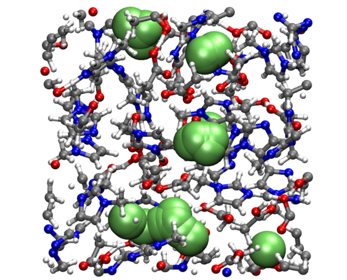

**FIG. 9.** N-메틸이미다졸과 아세트산을 포함하는 시뮬레이션 상자에서 감지된 공극 구체의 예(자세한 내용은 참고문헌 82 참조). 여러 개의 단일 구형 공극이 훨씬 더 큰 공극 공간 도메인으로 결합됩니다.

불필요한 거리를 계산하는 데 느립니다. 더 최적화된 접근 방식은 먼저 최대 관찰 범위를 정의합니다. 이 범위를 벗어난 모든 거리는 무시됩니다. 그런 다음 섹션 II A의 분자 인식에서 설명한 대로 공간 도메인 분해를 활용하여 최대 관찰 범위를 최소 큐브 직경으로 사용합니다. 이제 특정 물 분자에 대해 중앙 큐브와 26개의 주변 큐브 내의 이온만 해당 물 분자와 3-튜플을 형성하는 데 고려하면 되며, 어차피 조건을 충족하지 않을 모든 이온은 제외됩니다. 이것은 본질적으로 시스템 크기에 따라 선형적으로 확장되는 구현으로 이어집니다.

우리는 현재 이러한 모든 분석을 위한 통합 공식을 작업 중이며, 이를 **일반화된 튜플 분석(generalized tuple analysis, GenTup)**이라고 부릅니다. 중심 입자를 기반으로 필요한 만큼 많은 입자가 동시에 분석에 포함될 수 있습니다. 즉, 임의의 숫자 $n$에 대해 $n$-튜플을 반복하며, 이들은 모두 중심 입자 주위의 최대 관찰 범위 내에 위치해야 합니다(*최대 관찰 범위는 사용자가 선택할 수 있음*). 입자 간의 다양한 조건 관계(거리, 각도, 이면각, 삼각형 표면적, 사면체 부피 등)를 사용할 수 있습니다. 우리가 아는 한, 그러한 일반화된 분석은 아직 문헌에 발표되지 않았습니다. TRAVIS에서의 구현은 몇 달 안에 사용할 수 있게 될 것입니다.

## IV. 동적 분석 (DYNAMICAL ANALYSES)

이 섹션에서는 TRAVIS에 포함된 몇 가지 동적 분석에 대해 간략하게 논의합니다. 위에서 이미 설명했듯이 동적 분석은 궤적 프레임의 재배열에 불변이 아닌 분석으로 정의됩니다. 즉, 어떤 방식으로든 프레임의 순서에 의존합니다. 대부분의 동적 분석은 표준 몬테카를로 접근 방식에 물리적 시간이 존재하지 않으므로 몬테카를로 시뮬레이션에 적용해서는 안 됩니다.

### A. 확산 계수 (Diffusion coefficients)

응집상 시스템의 역학을 연구할 때 일반적인 양은 확산 계수입니다. 이는 실험적으로나 시뮬레이션을 통해 결정할 수 있으므로 시뮬레이션을 검증하는 데 귀중한 속성입니다. 일부 분자의 확산 계수 $D$는 아인슈타인 관계식[83]을 통해 **평균 제곱 변위(mean square displacement, MSD)**로부터 계산할 수 있습니다.

$$ D = \frac{1}{2d} \lim_{\tau \to \infty} \frac{\langle \|\mathbf{p}(t) - \mathbf{p}(t + \tau)\|^2 \rangle_t}{\tau}, \quad (3) $$

여기서 $\mathbf{p}(t)$는 시간 $t$에서 입자의 위치 벡터이고 $d$는 시스템의 차원(보통 $d = 3$)을 나타냅니다. TRAVIS는 MSD를 계산하고 자동으로 얻은 함수의 후반부에 선형 피팅을 수행하여 확산 계수를 결정할 수 있습니다. 몇 년 전, 푸리에 변환을 통해 MSD를 계산하는 빠른 방법이 문헌[84]에 제안되었습니다. 우리는 현재 이를 TRAVIS에 구현하고 있으며 몇 달 안에 사용할 수 있게 될 것입니다. TRAVIS로 계산된 MSD 및 확산 계수는 문헌[22,29,33,40,49,58,77,85–87]에 여러 번 등장했습니다.

시뮬레이션의 확산 계수에 대한 또 다른 접근 방식은 Green–Kubo 확산 관계식[88]으로, 이는 속도 자기상관 함수의 적분을 확산 계수와 관련시킵니다.

<!-- Page 11 -->

다음과 같습니다.

$$ D = \frac{1}{d} \int_{0}^{\infty} \langle \mathbf{v}(t) \cdot \mathbf{v}(t + \tau) \rangle_t \, d\tau, \quad (4) $$

여기서 $\mathbf{v}(t)$는 시간 $t$에서 고려된 입자의 속도 벡터이고 $d$는 다시 시스템의 차원을 나타냅니다. 또한 속도 자기상관 함수의 계산이 TRAVIS에 구현되어 있어 두 접근 방식의 결과를 비교할 수 있습니다(유한 길이 궤적의 경우 일반적으로 동일하지 않으며 어느 것이 "더 나은지" 불분명합니다).

### B. 재배향 역학 (Reorientation dynamics)

> > **분자동역학에서의 재배향 역학 (Reorientation Dynamics)**
>
> **1. 개념 정의**
> 재배향 역학은 분자 시스템 내에서 **분자의 회전축이나 특정 화학 결합의 방향이 시간에 따라 어떻게 변하는지**를 연구하는 분야입니다. 분자가 공간 상에서 고정되어 있지 않고 끊임없이 회전하거나 흔들리는 움직임을 정량적으로 분석합니다.
>
>
>
> **2. 핵심 분석 도구: 시간 상관 함수 (Time Correlation Function)**
> 주로 **재배향 시간 상관 함수 $C(t)$**를 사용하여 분석합니다. 특정 시간 $t=0$일 때의 분자 방향 벡터 $\vec{u}(0)$와 일정 시간 $t$가 지난 후의 방향 벡터 $\vec{u}(t)$ 사이의 연관성을 계산합니다.
> * $C(t) = \langle P_n(\vec{u}(t) \cdot \vec{u}(0)) \rangle$ (여기서 $P_n$은 르장드르 다항식)
> * 값이 1에서 0으로 떨어지는 속도를 통해 분자가 얼마나 빨리 회전하는지(유연성)를 알 수 있습니다.
>
> **3. 물리적 의미와 중요성**
> * **회전 완화 시간(Relaxation Time):** 상관 함수가 감쇠하는 속도를 측정하여 분자의 회전 속도를 결정합니다. 이는 액체의 점도나 주변 환경의 구속력과 밀접한 관련이 있습니다.
> * **수소 결합 분석:** 수소 결합 시스템(예: 물, 이온 액체)에서 재배향은 결합의 끊어짐과 형성을 반영하는 중요한 척도가 됩니다.
> * **실험 데이터와의 연결:** NMR(핵자기공명), 유전 완화 분광법(Dielectric Relaxation), IR(적외선) 분광학 등 실제 실험에서 얻은 데이터와 시뮬레이션 결과를 비교하는 가교 역할을 합니다.
>
> **4. 요약**
> 재배향 역학은 분자가 주변 환경(다른 분자와의 충돌, 정전기적 인력 등)에 의해 **어떻게 회전 운동을 방해받거나 촉진되는지**를 파악하여 시스템의 미시적 역동성을 이해하는 핵심 지표입니다.

또 다른 매우 흥미로운 동적 속성은 시뮬레이션에서 특정 벡터의 재배향 역학으로, 회전 이완 시간(rotational relaxation time)이라고도 합니다. 이는 특정 NMR 및 전자 상자성 공명(EPR) 기술로 직접 결정할 수 있으므로 실험과 시뮬레이션을 비교할 수 있는 좋은 기회를 제공합니다. 궤적을 기반으로 이 양은 해당 벡터 자기상관 함수 $C(\tau)$에 대한 적분으로 쉽게 표현할 수 있습니다. 일부 실험과의 비교를 위해 상관관계의 벡터 내적에 차수 $n$의 르장드르 다항식 $P_n$을 적용하는 것이 바람직하며, 이를 $n$차 상관 함수 $C_n(\tau)$ 및 $n$차 재배향 시간 $T_n$이라고 합니다. 이는 다음 방정식으로 이어집니다.

$$ C_n(\tau) = \int_{0}^{\infty} P_n \left( \frac{\mathbf{u}(t) \cdot \mathbf{u}(t + \tau)}{\|\mathbf{u}(t)\| \|\mathbf{u}(t + \tau)\|} \right) dt, \quad (5) $$

$$ T_n = \int_{0}^{\infty} C_n(\tau) \, d\tau, \quad (6) $$

여기서 $\mathbf{u}(t)$는 시간 $t$에서 시스템의 선택된 벡터입니다. 1차 르장드르 다항식 $P_1$은 항등식이므로 $n=1$에 대한 재배향 역학은 르장드르 다항식이 없는 경우와 같습니다. 일반적인 시뮬레이션 길이의 경우 벡터 자기상관 함수 $C(\tau)$는 0으로 감소하지 않으므로 $T$를 얻기 위한 적분을 직접 수행할 수 없습니다. 이를 극복하기 위해 TRAVIS는 최소 제곱 절차(*Levenberg–Marquardt minimizer* 사용)[89]를 통해 다중 지수 함수를 $C(\tau)$에 자동으로 피팅한 다음, 이를 분석적으로 적분하여 결과적으로 $T$를 결정합니다. TRAVIS로 계산된 벡터 재배향 시간은 이미 문헌[20,31,58,90–92]에 발표되었습니다.

>> **재배향 역학에서 n차(n-th Order)의 의미**
>
> **1. 수식적 정의: 르장드르 다항식의 차수**
> 재배향 역학을 계산할 때 사용하는 **르장드르 다항식 $P_n$의 차수**를 의미합니다. 벡터의 내적($\cos\theta$)에 어떤 함수를 씌워 상관관계를 볼 것인지 결정하는 숫자입니다.
> * **1차 ($n=1$):** $P_1(\cos\theta) = \cos\theta$
> * **2차 ($n=2$):** $P_2(\cos\theta) = \frac{1}{2}(3\cos^2\theta - 1)$
>
>
>
> **2. 물리적 의미: "어떤 실험과 비교할 것인가"**
> n차를 나누는 가장 큰 이유는 각 차수마다 대응되는 **실제 분석 실험**이 다르기 때문입니다.
> * **$n=1$ (1차 재배향):** 주로 **적외선(IR) 분광법**이나 **유전 완화(Dielectric Relaxation)** 실험 결과와 비교할 때 사용합니다. 분자의 쌍극자 모멘트 벡터가 어떻게 변하는지를 추적합니다.
> * **$n=2$ (2차 재배향):** 주로 **NMR(핵자기공명)**의 완화 시간 측정이나 **형광 이방성(Fluorescence Anisotropy)** 실험과 비교할 때 사용합니다. 2차는 벡터의 '방향'뿐만 아니라 '정렬 상태'의 대칭성까지 고려합니다.
>
> **3. 감쇠 속도의 차이**
> 같은 시스템이라도 차수($n$)가 높아질수록 상관 함수 $C_n(t)$는 **더 빨리 0으로 감소**합니다. 즉, 2차 재배향 시간($\tau_2$)은 보통 1차 재배향 시간($\tau_1$)보다 짧게 측정됩니다. (이론적으로 단순 회전 확산 모델에서는 $\tau_1 = 3\tau_2$의 관계를 가집니다.)
>
> **4. 요약**
> $n$차란 **"분자의 회전 운동을 어떤 수학적 잣대(실험적 관점)로 측정하느냐"**를 결정하는 지표입니다. 연구자가 비교하고자 하는 실험 데이터의 종류에 따라 적절한 $n$을 선택하여 계산하게 됩니다.

### C. 응집 역학 (Aggregation dynamics)

> > **1. 응집 역학 (Aggregation Dynamics)**
>
> **개념 정의**
> 분자동역학에서 이온 쌍(Ion pair)이나 수소 결합 복합체와 같은 특정 **분자 집합체(Aggregate)가 얼마나 오랫동안 유지되는지(평균 수명)**를 정량적으로 분석하는 학문입니다. 단순히 한 번의 관찰이 아니라, 수많은 형성-파괴 과정을 통계적으로 처리하여 물리적 의미를 도출합니다.
>
>
>
> **핵심 원리 및 분석법**
> * **기하학적 기준:** 거리나 각도 조건을 설정하여 두 분자가 결합 상태(1)인지 아닌지(0)를 판단하는 함수 $\beta_{ij}(t)$를 정의합니다.
> * **자기상관 함수 (Autocorrelation):** 시간 $t$에서의 결합 상태가 일정 시간($\tau$) 후에도 유지될 확률 $c(\tau)$을 계산합니다.
> * **평균 수명 계산:** 이 상관 함수를 시간에 대해 적분하여 집합체의 평균 수명($T$)을 얻습니다.
> * **반응 선속(Reactive Flux):** 분자가 잠시 멀어졌다가 다시 돌아오는 '확산 편향'을 제거하여, 순수하게 결합이 끊어지는 속도($k_d$)를 분리해내는 고급 분석 기법입니다.

--

-

컴퓨터 시뮬레이션에서 특정 응집체(예: *이온 쌍* 또는 *수소 결합 복합체*)의 평균 수명을 결정하는 것이 종종 바람직합니다. 궤적에서 그러한 복합체의 수명을 단순히 한 번 관찰하는 것은 확실히 유효한 접근 방식이 아닙니다. 분자 동역학 시뮬레이션은 혼돈 시스템이며, 우연히 0이 아닌 확률로 그러한 "실험"에서 임의의 수명을 얻을 수 있습니다. 유효한 접근 방식은 조사된 응집체가 충분히 여러 번 형성되고 깨질 때까지 시뮬레이션을 실행한 다음 자기상관 형식주의를 사용하여 수명을 결정하는 것입니다[93,94]. 이를 위해 먼저 응집에 대한 기하학적 기준을 선택합니다. 이것은 간단한 거리 기준이거나 더 복잡한 변형일 수 있습니다. 예를 들어, 기하학적 기준을 통해 수소 결합을 정의할 때 거리와 각도 모두에 대한 기준을 정의하는 것이 효과적인 것으로 나타났습니다(합리적인 수소 결합 기준에 대해서는 **Figure 2**의 노란색 직사각형 참조). 그런 다음 보조 함수

$$ \beta_{ij}(t) := \begin{cases} 1 & \text{if criteria fulfilled} \\ 0 & \text{otherwise} \end{cases} \quad (7) $$

가 정의됩니다. 여기서 $\beta_{ij}(t) = 1$은 선택된 기하학적 기준에 따라 시간 $t$에서 분자 $i$와 $j$ 사이의 응집체가 온전할 때 정확히 성립합니다. 이로부터 자기상관

$$ c(\tau) = \frac{1}{N^2} \sum_{i=1}^{N} \sum_{j=1}^{N} \int_{0}^{\infty} \beta_{ij}(t) \cdot \beta_{ij}(t + \tau) \, dt \quad (8) $$

이 계산됩니다. 응집체의 수명 $T$는 이 자기상관 함수의 총 적분의 두 배로 얻을 수 있습니다.

$$ T = 2 \cdot \int_{0}^{\infty} c(\tau) \, d\tau. \quad (9) $$

계수 2는 다음과 같은 간단한 고려 사항에서 이해할 수 있습니다: 시간 간격 $a$ 동안 한 번만 존재했던 응집체를 상상해 보십시오. 해당 상관 함수 $c(\tau)$는 두 점 $c(0) = 1$과 $c(a) = 0$을 통과하는 조각별 선형 함수입니다. 이 함수의 적분은 $a/2$가 됩니다. $a$의 원래 수명을 유지하려면 계수 2가 필요합니다.

실제로 상관 함수 $c(\tau)$는 종종 시뮬레이션 시간 내에 0으로 감소하지 않습니다. 섹션 IV B에서 설명한 대로 TRAVIS는 최소 제곱 절차(*Levenberg–Marquardt minimizer* 사용)[89]를 통해 상관 함수에 다중 지수 함수를 자동으로 피팅하고, 이를 분석적으로 적분하여 응집체의 수명을 얻습니다. 또한 유한 크기 시뮬레이션 셀에서 자기상관 함수는 0으로 감소하지 않습니다. 응집체를 형성한 두 분자는 결국 다시 만날 것이기 때문입니다. 올바른 수명을 얻으려면 지수 피팅 및 적분을 수행하기 전에 자기상관 함수에서 앙상블 평균값을 빼는 것이 중요합니다. TRAVIS는 이 보정을 자동으로 수행합니다.

위의 설명은 소위 *간헐적(intermittent)* 자기상관 함수에 해당합니다. TRAVIS는 *연속적(continuous)* 자기상관 함수도 계산할 수 있지만 여기서는 논의하지 않습니다. TRAVIS로 계산된 응집체 수명 및 자기상관 함수는 문헌[20,22,25,37,39,40,43,47,77,78]에 여러 번 발표되었습니다.

#### 1. 효율적인 구현 (Efficient implementation)

위에서 설명한 대로 응집체 수명을 계산하는 것은 매우 비효율적일 것입니다. 1000개의 분자와 $10^6$개의 궤적 단계를 가진 액체 물 힘장 궤적을 상상해 보십시오. 모든 쌍과 모든 시간 단계에 대해 $\beta_{ij}(t)$ 함수 값을 저장하려면 $10^{12}$개의 메모리 셀, 즉 모든 함수 값이 1바이트에 저장된다면 1 TB의 RAM이 필요합니다. 훨씬 더 나은 접근 방식은 응집체 목록을 유지하는 것입니다. 두 분자 사이의 모든 응집체에 대해, 해당 응집체에 어떤 두 분자가 관여했는지, 그리고 어느 시간 단계부터 어느 시간 단계까지 응집체가 온전했는지만 저장됩니다. 이러한 목록은 위에서 설명한 메모리의 아주 작은 부분만 필요로 하며, 모든 쌍 $i$와 $j$에 대해 목록에서 함수 $\beta_{ij}(t)$를 재구성할 수 있습니다. 이 접근 방식을 사용하면 $i$와 $j$의 한 쌍에 대한 데이터만 메모리에 저장하면 됩니다.

<!-- Page 12 -->

한 번에 메모리에 저장—어쨌든 결과 자기상관 함수는 모두 합산됩니다.

이것은 여전히 최적의 접근 방식이 아닙니다. $i \cdot j$개의 서로 다른 시계열의 자기상관을 계산해야 합니다. 자기상관은 위너-킨친(Wiener–Khintchine) 정리[95]로 인해 고속 푸리에 변환(FFT)을 사용하여 효율적으로 계산할 수 있지만 여전히 시간이 걸립니다. 훨씬 더 효율적인 방법은 $\beta_{ij}(t)$가 0과 1의 값만 가질 수 있으므로 직사각형 함수의 합으로 쓸 수 있다는 사실을 활용할 수 있습니다.

$$ R_{ab}(t) := \begin{cases} 1 & a \le t < b \\ 0 & \text{otherwise} \end{cases} \quad (10) $$

를 직사각형 함수라고 합시다. 두 함수 $R_{ab}(t)$와 $R_{cd}(t)$의 상호 상관(cross-correlation)은 간단한 조각별 선형 형태(*사다리꼴*)를 가집니다.

$$ \langle R_{ab}(t) \cdot R_{cd}(t + \tau) \rangle_t = \begin{cases} \frac{\tau - E}{F - E}, & E \le \tau < F \\ 1, & F \le \tau < G \\ \frac{\tau - H}{G - H}, & G \le \tau < H \\ 0, & \text{otherwise} \end{cases} \quad (11) $$

다음과 같은 치환을 사용합니다:

$$ E := c - b, \\ F := \min(c - a, d - b), \\ G := \max(c - a, d - b), \\ H := d - a. \quad (12) $$

$\beta_{ij}(t)$는 직사각형 함수의 합으로 쓸 수 있으므로(*목록에서 응집체 수명 간격을 앎으로써*), 자기상관의 결과 곱은 위에 표시된 대로 사다리꼴 함수의 합으로 확장("곱해짐")될 수 있습니다. 그러면 $i$와 $j$ 쌍에 대한 자기상관 함수는 실제 상관관계를 전혀 수행하지 않고 조각별 선형 함수의 합으로 직접 구성할 수 있습니다. 이 매우 효율적인 접근 방식은 TRAVIS에 구현되어 있습니다. 우리가 아는 한, 이것은 이전에 문헌에 설명된 적이 없습니다.

### D. 반응 선속 분석 (Reactive flux analysis)

섹션 IV C에서 설명한 접근 방식에서 얻은 수명은 경우에 따라 확산 편향(diffusion bias)을 겪습니다. Luzar와 Chandler의 반응 선속(reactive flux) 접근 방식[96–98]은 두 번째 연산자 $H(t)$의 도움으로 이 섭동을 제거합니다. 정의에 따르면, 상호 작용하는 쌍이 해당 상호 작용을 형성할 만큼 충분히 가깝다면 1이 되고 그렇지 않으면 0이 됩니다. 이를 통해 다음 함수를 계산할 수 있습니다.

$$ n(\tau) = \int_{0}^{\tau} \left( - \frac{\langle H(t) [1 - h(t)] \dot{h}(0) \rangle}{\langle h \rangle} \right) dt, \quad (13) $$

이는 시간 $t=0$에서 초기에 상호 작용하던 쌍이 더 이상 상호 작용하지 않지만, 시간 $t=\tau$에서 상호 작용이 가능한 거리에 여전히 있을 확률을 제공합니다. 마지막으로 두 함수 $c(t)$와 $n(t)$는 간단한 반응 속도 방정식에 피팅될 수 있습니다.

$$ -\dot{c}(t) = k_d c(t) - k_f n(t). \quad (14) $$

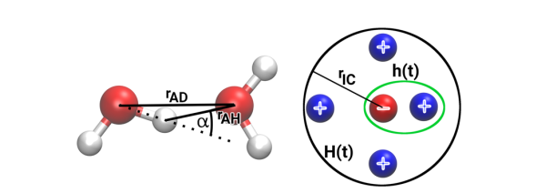

**FIG. 10.** 반응 선속 분석을 위한 기준. (왼쪽) 수소 결합 분석: 거리 $r_{AH}$와 각도 $\alpha$가 컷오프 미만이면 응집, 거리 $r_{AD}$를 통해 정의된 근접성. (오른쪽) 이온 쌍 분석: 다음 이웃(next neighbor) 조건을 통해 정의된 응집, 첫 번째 용매화 껍질의 거리 $r_{IC}$를 통해 정의된 근접성.

붕괴 속도 상수 $k_d$의 역수는 상호 작용의 평균 수명 $\tau_{lt} = k_d^{-1}$로 정의됩니다.

TRAVIS의 현재 구현[30,99]은 **Figure 10**의 왼쪽 부분에 시각화된 기하학적 기준에 기반한 수소 결합 분석뿐만 아니라, **Figure 10**의 오른쪽 부분에 설명된 대로 다음 이웃 조건과 거리에 기반한 이온 쌍 역학에 대한 분석을 가능하게 합니다. 상호 작용 역학의 분석은 화학 시스템의 분자 우주에 대한 더 깊은 통찰력을 허용하며[100], 특히 유기 촉매[101], 전해질[102], 금속 추출제[77]에서 그렇습니다.

### E. 반 호브 상관 함수 (Van Hove correlation functions)

> > **2. 반 호브 상관 함수 (Van Hove Correlation Function, VHCF)**
>
> **개념 정의**
> 일반적인 방사 분포 함수(RDF)가 '같은 시간'에 입자들이 어떻게 배치되어 있는지 보여준다면, 반 호브 함수는 **'시간 차이($\tau$)가 있는 두 순간' 사이의 입자 위치 관계**를 보여줍니다. 즉, **시간 지연이 포함된 RDF**라고 할 수 있습니다.
>
>
>
> **물리적 의미와 중요성**
> * **동적 구조 파악:** 시간 $\tau$가 흐름에 따라 초기 구조(RDF 특징)가 어떻게 붕괴되고 흐려지는지를 2차원 등고선 플롯으로 시각화합니다.
> * **실험과의 연결:** 이 함수의 2차원 푸리에 변환 결과는 **동적 구조 인자 $S(\mathbf{q}, \omega)$**가 됩니다. 이는 **중성자 산란 실험**으로 직접 측정이 가능하기 때문에, 시뮬레이션 결과가 실제 실험과 얼마나 일치하는지 검증하는 결정적인 도구가 됩니다.
> * **확산과 진동:** 입자가 제자리에서 진동하는지, 아니면 주변을 벗어나 확산되는지를 시공간적으로 동시에 관찰할 수 있게 해줍니다.

위에서 설명한 대로 RDF는 동일한 궤적 프레임에서 두 입자의 위치를 취하여 측정함으로써 계산됩니다.

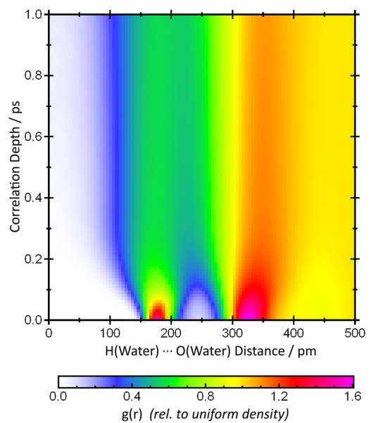

**FIG. 11.** TRAVIS로 계산된 액체 물의 O···H 거리에 대한 반 호브 상관 함수[103](즉, *지연 시간이 있는 RDF*). 이 함수의 2D 푸리에 변환은 동적 구조 인자 $S(\mathbf{q}, \omega)$에 해당합니다.

<!-- Page 13 -->

두 위치 사이의 거리, 그리고 결과를 히스토그램에 추가합니다. 그들 사이에 $\tau$의 "지연 시간(lag time)"을 두고 *서로 다른* 궤적 프레임에서 두 입자의 위치를 취하는 것은 흥미롭습니다. 이것이 다른 지연 시간에 대해 수행되고 가로축에 히스토그램 값을, 세로축에 지연 시간을 둔 등고선 플롯으로 표현된다면, 그 결과는 **반 호브 상관 함수(Van Hove correlation function, VHCF)**라고 불립니다[103]. **Figure 11**에는 액체 물 시뮬레이션에서 O···H 거리에 대한 반 호브 상관 함수가 제시되어 있습니다. $\tau = 0$에서 표준 RDF가 재현되는 것을 볼 수 있지만, 지연 시간이 증가함에 따라 RDF의 특징이 빠르게 흐려집니다. 반 호브 상관 함수는 2차원 푸리에 변환이 동적 구조 인자 $S(\mathbf{q}, \omega)$이기 때문에 특히 흥미롭습니다. 이는 중성자 산란 실험으로 측정할 수 있습니다. 이것은 실험 결과와 계산 결과를 직접 비교할 수 있는 또 다른 기회를 제공합니다.

## V. 분광학적 분석 (SPECTROSCOPIC ANALYSES)

> > **분자 동역학에서의 진동 스펙트럼 (Vibrational Spectrum)**
>
> **1. 개념 정의**
> 진동 스펙트럼은 분자 내 원자들이 화학 결합을 축으로 굽힘(Bending), 늘어남(Stretching)과 같은 **진동 운동을 할 때 발생하는 고유한 에너지 패턴**을 의미합니다. 흔히 '분자의 지문'이라 불리며, 적외선(IR) 분광법이나 라만(Raman) 분광법을 통해 실험적으로 측정하는 데이터입니다.
>
>
>
> **2. MD 시뮬레이션에서의 계산 원리**
> 분자 동역학(MD)에서는 시간에 따른 원자들의 위치와 속도 변화를 추적합니다. 이때 **원자 속도 자기상관 함수(Velocity Autocorrelation Function, VACF)** 또는 **쌍극자 모멘트(Dipole Moment)의 변화**를 기록한 뒤, 이를 **푸리에 변환(Fourier Transform)**하여 주파수 영역으로 옮기면 우리가 아는 진동 스펙트럼의 형태가 나타납니다.
>
> **3. 기존 정적-조화(Static-Harmonic) 방식과의 차이점**
> * **현실적인 환경 반영:** 기존 방식은 절대 영도($0\text{ K}$)에서 멈춰있는 단일 분자를 가정하지만, MD 기반 스펙트럼은 실제 온도와 압력, 그리고 주변 용매 분자들과의 상호작용(용매 효과)이 모두 포함된 결과를 보여줍니다.
> * **자동 컨포머 샘플링:** 분자가 스스로 구조를 바꾸며 움직이는 과정을 모두 반영하므로, 여러 구조가 섞여 있는 실제 액체 상태의 스펙트럼을 더 잘 묘사합니다.
> * **비조화 효과(Anharmonicity):** 실제 분자는 완벽한 용사철(조화 진동자)처럼 움직이지 않습니다. MD 시뮬레이션은 온도가 높아짐에 따라 주파수가 미세하게 변하거나, 배음(Overtone)이 발생하는 등의 복잡한 비조화 물리 현상을 자연스럽게 포함합니다.
>
> **4. 요약**
> 여기서 말하는 진동 스펙트럼은 **분자의 역동적인 움직임을 시간 순서대로 기록한 뒤 수학적으로 분석하여 얻은 '에너지 지도'**입니다. TRAVIS와 같은 도구는 CP2K 같은 양자 역학 계산 엔진과 결합하여, 실험실에서 측정한 IR이나 라만 데이터와 직접 비교할 수 있는 정밀한 가상 스펙트럼을 생성해 줍니다.

분자 동역학 시뮬레이션에서 시간 상관 함수를 통해 진동 스펙트럼을 계산할 수 있다는 것은 오래전부터 알려져 왔습니다[104]. 이는 스펙트럼에 대한 널리 사용되는 정적-조화(static-harmonic) 접근 방식에 비해 몇 가지 장점이 있습니다. MD 시뮬레이션 중에 자동 컨포머(conformer) 샘플링이 이루어지고, 전체 용매 효과가 포함될 수 있으며, 현실적인 밴드 모양을 직접 얻을 수 있고, 심지어 일부 비조화 효과(*온도 의존 주파수 이동 및 근사 배음 및 결합 밴드*)도 다룹니다[105]. 지난 몇 년 동안 진동 스펙트럼을 예측하기 위한 많은 기능이 TRAVIS에 구현되었습니다. 이 섹션에서는 이러한 방법과 기술에 대한 개요를 제공합니다. CP2k[106]와 TRAVIS를 사용하여 진동 스펙트럼을 계산하는 자세한 단계별 튜토리얼은 인터넷에서 찾을 수 있습니다[107].

### A. 일반 처리 기술 (General processing techniques)

이 섹션에서는 모든 유형의 진동 스펙트럼 계산과 관련된 TRAVIS에서 사용되는 몇 가지 일반적인 기술을 설명합니다. 이러한 기술의 대부분은 신호 처리의 기본 지식이지만 컴퓨터 시뮬레이션에 관한 기사에서는 거의 논의되지 않습니다.

#### 1. 빠른 상관 (Fast correlation)

분자 동역학 시뮬레이션에서 진동 스펙트럼을 예측하는 모든 방법은 궤적을 따른 일부 시계열의 자기상관 또는 상호 상관 함수를 기반으로 합니다. 일반적으로 이러한 상관관계는 전체 시뮬레이션 상자의 속성이 아니라 분자 속성에 대해 계산됩니다. 그 이유는 전체 시스템의 속성을 상관시키는 것은 서로 다른 분자 간의 모든 상호 상관을 고려하는 것과 동일하기 때문입니다. 그러나 매우 먼 분자의 운동은 전혀 상관관계가 없으므로 이러한 상호 상관은 대부분 스펙트럼에 노이즈를 도입합니다. 모든 분자 상관 함수를 계산하려면 많은 계산 능력이 필요합니다. 각 계산은 $O(m \cdot n)$으로 확장되기 때문입니다. 여기서 $n$은 시계열의 길이이고 $m$은 선택된 상관 깊이입니다. 다행히도 위너-킨친(Wiener–Khintchine) 정리[95]가 존재하며, 이는 시계열 $f(t)$의 자기상관 $C(\tau)$를 계산하는 것이 푸리에 변환과 동일하다는 것을 나타냅니다.

시계열을 변환하고, 절대 제곱을 취하고, 역변환합니다.

$$ C(\tau) = \int_{-\infty}^{\infty} \overline{f(t)} \cdot f(t + \tau) \, dt = \mathcal{F}^{-1} \left( \left| \mathcal{F}(f(\tau)) \right|^2 \right). \quad (15) $$

길이 $n$의 이산 데이터셋의 푸리에 변환은 $O(n \cdot \log n)$으로만 확장되는 고속 푸리에 변환(FFT) 방법으로 효율적으로 계산할 수 있으므로 많은 계산 시간을 절약할 수 있습니다. 방정식 (15)는 상호 상관 정리의 특수한 경우일 뿐이므로 유사한 접근 방식을 사용하여 FFT를 통해 상호 상관 함수의 계산 속도를 높일 수도 있습니다. TRAVIS는 KISS FFT 라이브러리[108](*TRAVIS 소스 코드에 통합됨*)를 사용하여 이러한 접근 방식을 기반으로 모든 자기상관 및 상호 상관 함수를 계산합니다.

#### 2. 윈도우 함수 및 제로 패딩 (Window function and zero padding)

데이터의 푸리에 변환을 고려할 때 적절한 윈도우 함수를 선택하는 것이 매우 중요합니다. 윈도우 함수가 없는 푸리에 변환은 존재하지 않습니다—윈도우 함수를 사용하지 않는다는 것은 직사각형 윈도우를 사용한다는 것을 의미하며, 이는 매우 나쁜 선택입니다. 윈도우 함수를 적용한다는 것은 단순히 푸리에 변환 전에 이산 입력 데이터와 윈도우 함수를 요소별로 곱하는 것을 의미합니다. 기본적으로 TRAVIS는 스펙트럼 계산을 위해 Hann 윈도우 함수[109]를 사용하며, 이는 다음과 같이 주어집니다.

$$ W_n = \cos^2 \left( \frac{\pi n}{2(N - 1)} \right), \quad (16) $$

그러나 다른 윈도우 함수(지수, 가우시안)도 구현되어 있습니다. 이산 데이터셋 $a_i$의 푸리에 변환의 총 적분은 첫 번째 값 $a_0$에만 의존합니다. 따라서 조건 $W_0 = 1$을 충족하는 모든 윈도우 함수는 총 적분을 전혀 수정하지 않습니다. 다시 말해, 윈도우 함수는 스펙트럼의 피크 모양을 변경하지만 밴드의 적분 강도는 유지합니다.

푸리에 변환 전에 상관 함수의 꼬리에 0을 추가함으로써 결과 스펙트럼의 해상도를 높일 수 있으며, 이를 제로 패딩(zero padding)이라고 합니다. 이 기술로 새로운 스펙트럼 정보를 얻는 것은 아니며, 단지 원본 스펙트럼의 데이터 포인트 사이를 보간하는 것, 즉 미용적인 조치입니다. 기본적으로 TRAVIS는 제로 패딩 계수 4를 사용합니다.

#### 3. 유한 차분 보정 (Finite difference correction)

대부분의 스펙트럼에서 양 자체 대신 시간 미분이 상관 함수에 들어갑니다. 코사인 함수 $\cos(\omega t + \varphi)$의 경우 2차 중심 유한 차분 미분은 다음과 같이 주어짐을 보일 수 있습니다[105].

$$ D \cos(\omega t + \varphi) = \frac{\cos(\omega(t + \Delta t) + \varphi) - \cos(\omega(t - \Delta t) + \varphi)}{2\Delta t} \\ = -\omega \sin(\omega t + \varphi) \frac{\sin(\omega \Delta t)}{\omega \Delta t}, \quad (17) $$

즉, 미분의 정확한 값에 *sinus cardinalis* (sinc) 함수 $\frac{\sin(\omega \Delta t)}{\omega \Delta t}$가 곱해집니다. 상관 함수에서 두 시간 미분의 곱이 형성되므로, 올바른 강도를 얻으려면 최종 스펙트럼을 $\left( \frac{\sin(\omega \Delta t)}{\omega \Delta t} \right)^2$ 계수로 나누어야 합니다. 이 보정은 TRAVIS에 구현되어 있으며 기본적으로 활성화되어 있습니다.

<!-- Page 14 -->

보정 덕분에 쌍극자 모멘트가 4.0 fs마다 계산된 경우에도 정확한 강도를 가진 고품질 스펙트럼을 얻을 수 있습니다.

#### 4. 시간 가역성을 통한 샘플링 개선 (Improved sampling via time reversibility)

대부분의 다른 속성과 마찬가지로 진동 스펙트럼은 시간 방향의 반전에 불변이어야 합니다: 역시간 궤적은 순방향 궤적과 동일한 열역학적 앙상블을 샘플링합니다. 진동 스펙트럼은 앙상블 평균이므로 이 두 경우에 대해 다를 수 없습니다. 궤적을 따른 두 시계열 $a(t)$와 $b(t)$의 상호 상관을 고려하십시오. $\tilde{a}(t) := a(T - t)$ 및 $\tilde{b}(t) := b(T - t)$를 역시간 궤적의 두 시계열이라고 합시다. 여기서 $T$는 총 궤적 길이입니다. 우리는 다음을 발견합니다.

$$ \langle \tilde{a}(t + \tau) \cdot \tilde{b}(t) \rangle_t = \int \tilde{a}(t + \tau) \cdot \tilde{b}(t) dt \\ = \int a(T - t - \tau) \cdot b(T - t) dt \\ = \int a(\tilde{t}) \cdot b(\tilde{t} + \tau) d\tilde{t} \\ = \langle b(\tilde{t} + \tau) \cdot a(\tilde{t}) \rangle_{\tilde{t}} \quad (18) $$

치환 $\tilde{t} := T - t - \tau$를 사용합니다. 따라서 시간 방향의 반전은 상호 상관의 첫 번째와 두 번째 인수를 바꾸는 것과 같습니다. 스펙트럼이 시간 반전에 불변이라면 기본 상호 상관 함수도 불변이어야 합니다. 따라서 두 인수를 바꾸면 무한 궤적 길이에 대해 동일한 상관 함수가 산출됩니다. 그러나 실제로는 샘플링이 완벽하지 않으며 통계적 노이즈로 인해 두 상관 함수가 다릅니다. 두 상관 함수(*순방향 시간 및 역방향 시간*)의 산술 평균을 취함으로써[Eq. (19) 참조], 샘플링은 효과적으로 2배 증가합니다. 우리는 이 접근 방식을 "교환자 트릭(commutator trick)"이라고 부릅니다.

$$ \text{CCF}(a, b) := \frac{1}{2} \left( \langle a(t + \tau) \cdot b(t) \rangle_t + \langle b(t + \tau) \cdot a(t) \rangle_t \right). \quad (19) $$

이것은 $a(t)$와 $b(t)$가 다른 시계열인 경우, 즉 진정한 상호 상관의 경우에만 샘플링을 개선합니다. $a$와 $b$가 동일한 경우(즉, *적외선 스펙트럼을 위해 쌍극자 모멘트를 상관시키는 것과 같은 자기상관*), 얻는 것은 없습니다.

두 속성 $a$와 $b$ 중 하나가 자기 쌍극자 모멘트인 경우 또 다른 미묘함이 발생합니다[*이는 진동 원형 이색성(VCD) 및 라만 광학 활성(ROA) 스펙트럼에 필요함; 아래 참조*]. 이 양은 원자 속도에 선형적으로 의존합니다. 시간 반전은 모든 원자 속도를 반전시키므로 자기 쌍극자 모멘트의 부호를 바꿉니다. 이 경우 두 상관 함수의 평균을 취하면 두 기여가 상쇄되므로 노이즈만 산출됩니다. 원하는 효과를 얻으려면 역시간 상관 함수의 부호를 변경해야 하며, 이는 다음 방정식으로 주어집니다.

$$ \text{CCF}^*(a, b) := \frac{1}{2} \left( \langle a(t + \tau) \cdot b(t) \rangle_t - \langle b(t + \tau) \cdot a(t) \rangle_t \right). \quad (20) $$

#### 5. Verlet 주파수 이동 보정 (Correcting the Verlet frequency shift)

유한 시간 단계를 가진 시스템의 역학을 설명하는 것은 불행히도 조화 진동자의 진동 주파수를 불변으로 남겨두지 않습니다. "진정한" 주파수 $\omega_0$를 가진 조화 진동자가 적분기 시간 단계 $\Delta t$를 가진 Verlet 적분 방식[110]으로 해결되는 경우, 관찰된 주파수 $\tilde{\omega}$는 다음과 같이 주어짐을 유도할 수 있습니다[105].

$$ \tilde{\omega} = \frac{1}{\Delta t} \arccos \left( 1 - \frac{1}{2} \omega_0^2 \Delta t^2 \right). \quad (21) $$

다행히도 효과는 다소 작습니다. $\omega_0 = 3000.0 \, \text{cm}^{-1}$ 및 $\Delta t = 0.5 \, \text{fs}$인 진동자를 시뮬레이션할 때 관찰된 주파수는 $\tilde{\omega} = 2990.0 \, \text{cm}^{-1}$이며, 이는 약 0.3%의 편차입니다. 궤적에서 스펙트럼을 계산할 때 관찰된 주파수 $\tilde{\omega}$가 주어지고 진정한 주파수 $\omega_0$를 찾습니다. Eq. (21)의 역함수는 다음과 같이 쉽게 쓸 수 있습니다.

$$ \omega_0 = \frac{\sqrt{2 - 2 \cos(\tilde{\omega} \Delta t)}}{\Delta t}. \quad (22) $$

Eq. (22)를 사용하여 스펙트럼의 주파수 축을 Verlet 적분기의 주파수 이동에 대해 보정할 수 있습니다. 이 보정은 TRAVIS에 구현되어 있습니다.

### B. 보로노이 적분 (Voronoi integration)

분자 동역학 시뮬레이션에서 진동 스펙트럼을 계산하려면 분자 전기적 특성(예: *쌍극자 모멘트*)이 필요합니다. 이를 얻는 표준 접근 방식은 소위 Wannier 국소화(Wannier localization)입니다[111,112]. 공간적 확산을 최소화하는 유니터리 변환이 분자 궤도 세트에 적용되어 국소화된 Wannier 궤도를 산출합니다. 각 궤도에 대해 질량 중심("Wannier 중심"이라고 함)은 정수 점전하로 간주될 수 있습니다. Wannier 중심을 개별 분자에 할당함으로써 분자 쌍극자 모멘트를 계산할 수 있습니다. 하나의 고립된 분자의 경우 이것은 근사치조차 아닙니다. 그러나 이 접근 방식에는 몇 가지 제한 사항이 있습니다. 첫째, 많은 계산 시간이 필요합니다(*1000개 정도의 원자가 있는 시스템의 경우 실제 SCF 주기보다 쉽게 더 많이 걸림*). 더 나쁜 것은 Wannier 중심을 결정하는 반복적 접근 방식이 때때로 전혀 수렴하지 않는다는 사실입니다. 그 외에도 방향족 시스템에 문제가 발생합니다. Wannier 국소화는 방향족 시스템에서 교대하는 단일 결합-이중 결합 패턴을 강제하며, 이는 우리가 최근 보고한 바와 같이 인공 스펙트럼 밴드를 도입할 수 있습니다[113]. 방향족 시스템의 라만 스펙트럼에 대한 분자 분극률을 계산할 때 Wannier 국소화에 의해 도입된 수치적 노이즈는 스펙트럼 자체보다 몇 배 더 큽니다. 마지막으로, 우리가 아는 한 Wannier 중심에서 분자 사중극자 모멘트를 도출하는 것은 불가능합니다. 그러나 이러한 사중극자 모멘트는 ROA 스펙트럼 계산에 필요합니다.

벌크 상 시스템에서 분자 특성을 계산할 때 이러한 문제를 극복하기 위해 우리는 2015년에 보로노이 적분을 개발했습니다[113]. 시스템의 주기적 라디칼 보로노이 테셀레이션[67,70,71](원자를 보로노이 사이트로, 원자 반데르발스 반경[114]을 보로노이 반경으로 함)이 Voro++ 라이브러리[68,69]를 사용하여 계산된 후, 그리드에 제공된 총 전자 밀도 $\rho(\mathbf{r})$는 분자의 보로노이 셀 내에서 직접 적분되어 원하는 분자 모멘트(예: 전기 쌍극자 모멘트 $\mathbf{p}^{\text{Mol}}$ 및 전기 사중극자 모멘트 $\mathbf{Q}_{ij}^{\text{Mol}}$)를 산출합니다.

$$ \mathbf{p}^{\text{Mol}} = \sum_{n=1}^{N_{\text{Mol}}} q_n \mathbf{r}_n - \int_{\text{Mol}} \rho(\mathbf{r}) \mathbf{r} \, d^3\mathbf{r}, \quad (23) $$

<!-- Page 15 -->

$$ \mathbf{Q}_{ij}^{\text{Mol}} = \sum_{n=1}^{N_{\text{Mol}}} q_n (3r_{n,i}r_{n,j} - \|\mathbf{r}_n\|^2 \delta_{ij}) - \int_{\text{Mol}} \rho(\mathbf{r}) (3r_i r_j - \|\mathbf{r}\|^2 \delta_{ij}) \, d^3\mathbf{r}, \quad (24) $$

여기서 $q_n$과 $\mathbf{r}_n$은 각각 분자 내 $n$번째 원자의 핵심 전하와 위치이며, $\delta_{ij}$는 크로네커 델타입니다. 우리는 보로노이 적분을 통해 얻은 스펙트럼이 Wannier 국소화에 기반한 스펙트럼과 매우 유사하지만 방향족 시스템의 문제가 더 이상 존재하지 않음을 보여주었습니다[113]. 또한 우리의 적분 알고리즘은 매우 빠르므로(*하나의 CPU 코어에서 전체 프레임당 ~1초*) Wannier 국소화에 비해 많은 계산 시간이 절약됩니다. 마지막으로 전기 사중극자 모멘트(*ROA 스펙트럼 계산에 필요*)와 같은 더 높은 분자 다중극자 모멘트도 쉽게 얻을 수 있습니다. 궤적을 따라 필요한 체적 전자 밀도는 고효율 무손실 압축 형식 BQB[7]에 저장할 수 있습니다(*위 참조*). 따라서 우리는 보로노이 적분 기술을 벌크 상 시스템에서 분자 특성을 얻기 위한 새로운 표준 방법으로 제안합니다.

### C. 파워 스펙트럼 (Power spectra)

> 정의: 원자 속도 자기상관 함수(Atomic Velocity Autocorrelation Function)를 푸리에 변환하여 얻은 스펙트럼입니다.
> 특징:
  - 진동 상태 밀도(VDOS, Vibrational Density of States)라고도 불립니다.
  - 실험적 스펙트럼과 달리 '선택 규칙'의 제한을 받지 않아 시스템 내의 모든 운동을 포함합니다.
  - 적분 시 등분배 정리에 따라 각 자유도의 온도를 산출할 수 있어, 시뮬레이션의 평형 상태를 확인하는 지표로 사용됩니다.

원자 속도 자기상관 함수의 푸리에 변환은 시스템의 파워 스펙트럼을 산출하며, 이는 진동 상태 밀도(VDOS)라고도 합니다. 실험적으로 접근 가능한 진동 스펙트럼과 달리 파워 스펙트럼은 선택 규칙에 기반하지 않고 시스템의 모든 운동을 포함합니다. 단위가 올바르게 선택되고 원자 질량 가중치가 적용되면 파워 스펙트럼의 피크에 대한 적분은 해당 자유도의 온도를 켈빈 단위로 직접 산출합니다. 이것은 시뮬레이션이 잘 평형되었는지 확인하는 흥미로운 기능입니다: 등분배 정리에 따르면 모든 자유도는 동일한 온도를 가져야 합니다. 파워 스펙트럼의 적분이 그렇지 않을 수 있음을 나타내는 경우 더 긴 평형화가 권장될 수 있습니다. 한 가지 예가 **Figure 12**에 제시되어 있으며, 여기에는 20개의

**FIG. 12.** 서로 다른 원자 질량과 힘 상수를 가진 20개의 서로 다른 조화 이원자 분자를 포함하는 시스템의 파워 스펙트럼(검은색 곡선)과 각 정규 모드의 온도를 묘사하는 적분(빨간색 곡선).

서로 다른 조화 결합을 가진 이원자 분자(검은색 곡선)가 밴드에 대한 적분(빨간색 곡선)과 함께 표시됩니다. 적분이 모두 비슷한 크기이므로 시스템은 잘 평형된 것으로 보입니다. TRAVIS로 계산된 파워 스펙트럼은 이미 문헌[22,25,33,37,41,72,115–117]에 여러 번 등장했습니다.

### D. 벌크 상 정규 모드 (Bulk phase normal modes)

> 정의: 모든 원자 속도 상호 상관 함수(Cross-correlation Function) 행렬을 대각화하여, 전체 파워 스펙트럼을 주파수 공간에서 국소화된 개별 진동 모드로 분해하는 분석법입니다.
> 특징:
  - 복잡한 벌크 시스템 내에서 특정 분자의 개별 진동(예: C-H 스트레칭)을 구별해낼 수 있습니다.
  - 분석을 위해 참조 구조(Reference Structure)가 필요하며, 단단한(Rigid) 분자 구조 분석에 가장 적합합니다.

Mathias 등[118,119]이 제시한 접근 방식을 기반으로 우리는 TRAVIS에 벌크 상 정규 모드 분석을 구현했습니다[115]. 모든 원자 속도 상호 상관 함수의 행렬을 반복적으로 대각화함으로써 시스템의 파워 스펙트럼은 주파수 공간에서 최대한 국소화된 정규 모드로 분해됩니다. 이를 위해서는 궤적의 분자가 투영되는 참조 구조 세트가 필요합니다. 이 요구 사항으로 인해 이 접근 방식은 단단한 분자에 가장 적합하며 에틸 그룹보다 긴 유연한 측쇄에 대해서는 심각한 제한이 있습니다. **Figure 13**에는 정규 모드 분석의 예시적인 적용이 나와 있으며, 여기서 [EMIm]$^+$ 양이온의 개별 C–H 스트레칭 운동은 순수 [EMIm][OAc] 및 [EMIm][OAc]/물 혼합물의 벌크 상 시뮬레이션에서 구별됩니다[115]. 문헌에는 TRAVIS의 이 기능이 적용된 다른 기사들도 있습니다[37,120–122].

### E. 적외선 및 라만 스펙트럼 (Infrared and Raman spectra)

> 적외선(IR) 스펙트럼:
  - 분자 쌍극자 자기상관 함수(Molecular Dipole Autocorrelation Function)를 푸리에 변환하여 계산합니다.
  - 분자의 극성 변화와 관련된 진동을 보여줍니다.

> 라만(Raman) 스펙트럼:
  - 분자 분극률 자기상관 함수(Molecular Polarizability Autocorrelation Function)를 푸리에 변환하여 계산합니다.
  - 분자의 모양이나 부피 변화와 관련된 진동을 보여줍니다.

> 공통점:
  - 파워 스펙트럼과 달리 실험 데이터와 직접적인 비교가 가능하며, 최근에는 보로노이 적분 방법 등을 통해 높은 정확도로 예측됩니다.

시스템의 적외선 스펙트럼은 시뮬레이션 궤적을 따른 분자 쌍극자 자기상관 함수의 푸리에 변환으로 계산할 수 있습니다. 최초의 *ab initio* 분자 동역학(AIMD) 시뮬레이션이 수행된 직후, AIMD에 기반한 최초의 예측 적외선 스펙트럼이 1997년에 발표되었으며[123], 여러 응용 및 추가 개발이 뒤따랐습니다[124–126]. 라만 스펙트럼의 경우 분자 분극률이 대신 상관되어야 합니다. AIMD에서 예측된 최초의 라만 스펙트럼은 2002년에 나타났습니다[127]. AIMD 시뮬레이션의 이러한 스펙트럼이 실험과 매우 잘 일치한다는 것이 문헌에서 여러 번 입증되었습니다. 이러한 스펙트럼 계산을 위한 모듈이 2013년에 TRAVIS에 추가되었습니다[128]. 처음에는 Wannier 중심을 사용했지만 지금은 보로노이 적분 방법을 기반으로 합니다(*위 참조*)[113]. TRAVIS로 계산된 적외선 및 라만 스펙트럼은 문헌[87,122,129–134]에 여러 번 발표되었습니다.

> 라만(Raman) 스펙트럼과 적외선(IR) 스펙트럼은 모두 분자 진동(정확히는 정상모드, normal modes)의 에너지 준위 사이 전이를 관측해 **결합과 구조를 진단**하는 진동 분광법이지만, 신호가 만들어지는 물리 과정과 “어떤 진동이 잘 보이는지”를 결정하는 선택 규칙(selection rule)이 다릅니다. IR 스펙트럼은 분자가 적외선 광자를 **흡수(absorption)** 하면서 진동 준위가 (v=0\to1) 등으로 바뀌는 과정이고, 어떤 정상모드가 IR에서 관측되려면 진동하는 동안 분자의 **쌍극자 모멘트(dipole moment)가 변해야** 합니다(수학적으로는 해당 정상모드 좌표 (Q)에 대해 (\partial \mu/\partial Q \neq 0)). 그래서 C=O, O–H, N–H처럼 **극성 결합**이 포함되거나, 진동으로 분자 전체의 전하 분포 비대칭이 커졌다가 작아지는 모드가 IR에서 강하게 나타납니다. 실험적으로는 FT-IR(푸리에 변환 적외선 분광) 장비가 가장 흔하고, 시료는 KBr pellet, 박막, 용액 셀, 그리고 표면/박막에 편한 ATR(attenuated total reflection) 방식으로 많이 측정합니다. IR 피크 위치(보통 cm(^{-1}))는 결합 강도와 환원질량에 의해 주로 결정되며, 피크의 모양과 이동(예: 수소결합에 의한 O–H 신장 밴드의 broadening 및 red-shift)은 분자 간 상호작용과 환경(용매, 온도, 상)에 민감합니다.

> 반면 라만 스펙트럼은 흡수가 아니라, 단색 레이저를 쏘았을 때 산란광 중에서 입사광과 에너지가 다른 성분(비탄성 산란)을 측정하는 **라만 산란(inelastic scattering)** 에 기반합니다. 분자가 레이저 전기장에 의해 순간적으로 유도 쌍극자(induced dipole)를 만들고(즉 분극됨), 그 유도 쌍극자가 빛을 재방출하면서 진동 에너지가 교환되어 산란광의 주파수가 이동하는데, 이때 어떤 정상모드가 라만에서 보이려면 진동 동안 분자의 **분극률(polarizability)이 변해야** 합니다( (\partial \alpha/\partial Q \neq 0)). 그래서 대체로 C=C, C–C 같은 **비극성 또는 대칭성이 큰 결합/골격 진동**이 라만에서 강하게 나타나는 경향이 있고, 반대로 매우 극성인 진동은 IR에 더 강하게 나타나는 경우가 많습니다. 라만은 물(H(_2)O)의 IR 흡수가 강해 IR에서는 물 배경이 문제될 때가 많은 반면, 라만은 물의 라만 산란이 상대적으로 약해 **수용액 시료에 유리**한 경우가 많습니다. 다만 형광(fluorescence)이 강한 시료는 라만 신호를 덮어버릴 수 있어 레이저 파장 선택(예: 785 nm, 1064 nm)이나 SERS(표면증강 라만), 공명 라만(resonance Raman) 같은 변형 기법을 사용하기도 합니다.

> 두 방법은 상호 보완적이라 “IR과 라만을 함께” 보면 구조 해석이 훨씬 강해집니다. 특히 중심대칭(centrosymmetric) 분자에서는 **상호 배타 규칙(mutual exclusion)** 이 자주 성립해, 어떤 모드는 IR에 강하면 라만에는 약하고(또는 반대) 나타나는 경향이 있어 대칭성 판단에도 도움이 됩니다. 실무적으로는 IR은 기능기(예: C=O, O–H, N–H) 확인과 수소결합/환경 변화 추적에 강하고, 라만은 탄소 골격·대칭 진동, 결정성/상(phase) 분석, 수용액 측정, 그리고 공간 분해가 필요한 매핑(현미경 라만)에 강합니다.

### F. VCD 및 ROA 스펙트럼 (VCD and ROA spectra)

분자 시스템의 진동 원형 이색성(VCD) 스펙트럼은 분자 전기 쌍극자 모멘트 $\mathbf{p}^{\text{Mol}}(t)$와 분자 자기 쌍극자 모멘트 $\mathbf{m}^{\text{Mol}}(t)$를 상호 상관시켜 계산할 수 있습니다. 그러나 자기 쌍극자 모멘트는 Born–Oppenheimer 분자 동역학(BOMD) 시뮬레이션에서 쉽게 얻을 수 없습니다. 자기 모멘트는 전류에서 발생하고 Born–Oppenheimer 근사는 전류를 설명하지 않기 때문입니다. 한 가지 해결책은 일종의 섭동 이론(예: NVPT[135,136])을 적용하는 것이지만, 이는 많은 계산 자원을 필요로 합니다. 최근에 우리는 궤적을 따른 후속 단계의 총 전자 밀도 차이에서 전류를 재구성하는 순수 고전적 접근 방식을 개발했습니다[137]. 전류 밀도 $\mathbf{j}(\mathbf{r})$가 그리드에서 얻어지면 분자 보로노이 셀에 대한 적분은 분자를 산출합니다.

<!-- Page 16 -->

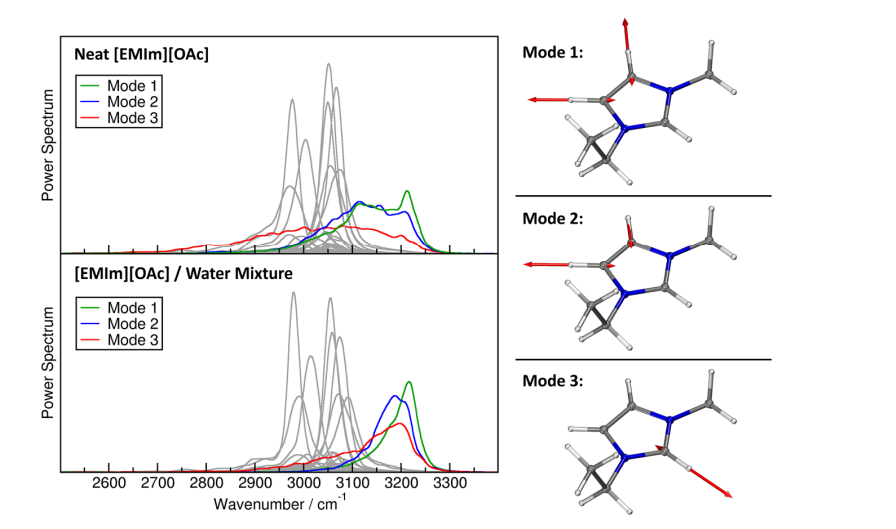

**FIG. 13.** 순수 [EMIm][OAc] 및 [EMIm][OAc]/물 혼합물의 시뮬레이션에서 파워 스펙트럼의 정규 모드 분해를 통해 [EMIm]$^+$ 양이온의 C–H 스트레칭 밴드를 구별할 수 있습니다[115].

고전적 표현을 통한 자기 쌍극자 모멘트 $\mathbf{m}^{\text{Mol}}$:

$$ \mathbf{m}^{\text{Mol}} = \frac{1}{2} \sum_{n=1}^{N_{\text{Mol}}} q_n (\mathbf{r}_n \times \mathbf{v}_n) - \frac{1}{2} \int_{\text{Mol}} \mathbf{r} \times \mathbf{j}(\mathbf{r}) \, d^3\mathbf{r}, \quad (25) $$

여기서 $\mathbf{v}_n$은 분자 내 $n$번째 원자의 속도입니다. TRAVIS에 구현된 이 접근 방식을 기반으로 우리는 2016년에 벌크 상 VCD 스펙트럼의 최초 *ab initio* 예측을 발표했습니다[137].

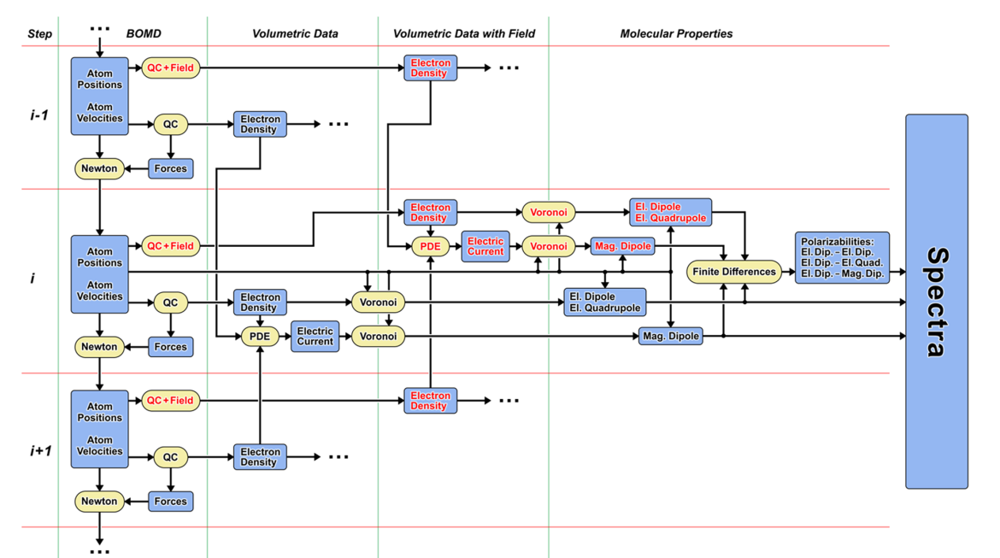

**FIG. 14.** 표준 BOMD 시뮬레이션에서 ROA 스펙트럼을 위한 전자기 모멘트를 계산하는 개략적 접근 방식[138]. 행은 연속적인 BOMD 시간 단계를 나타냅니다. 빨간색 글꼴은 외부 전기장 하의 양을 나타냅니다.

<!-- Page 17 -->

분자 동역학 시뮬레이션에서 라만 광학 활성(ROA) 스펙트럼을 계산하는 것은 약간 더 복잡합니다. 필요한 상관 함수는 전기 쌍극자-전기 쌍극자 분극률 $\boldsymbol{\alpha}^{\text{Mol}}$, 전기 사중극자-전기 쌍극자 분극률 $\mathbf{A}^{\text{Mol}}$, 그리고 자기 쌍극자-전기 쌍극자 분극률 $\mathbf{G}^{\prime\text{Mol}}$을 기반으로 합니다. 다음을 보일 수 있습니다[139].

$$ \boldsymbol{\alpha}^{\text{Mol}} = \frac{d}{d\mathbf{E}} \mathbf{p}^{\text{Mol}}, \quad (26) $$

$$ \mathbf{A}^{\text{Mol}} = \mathcal{A}^{\text{Mol}} = \frac{d}{d\mathbf{E}} \mathbf{Q}^{\text{Mol}}, \quad (27) $$

$$ \mathbf{G}^{\prime\text{Mol}} = -(\mathcal{G}^{\prime\text{Mol}})^T = -\left( \frac{d}{d\mathbf{E}} \mathbf{m}^{\text{Mol}} \right)^T \quad (28) $$

전기 쌍극자-전기 사중극자 분극률 $\mathcal{A}^{\text{Mol}}$과 전기 쌍극자-자기 쌍극자 분극률 $\mathcal{G}^{\prime\text{Mol}}$을 사용하여 세 가지 양 모두 적용된 외부 전기장 $\mathbf{E}$의 유한 차분을 통해 얻을 수 있습니다. ROA 스펙트럼에 필요한 분극률을 계산하는 개략적 접근 방식은 **Figure 14**에 제시되어 있습니다. 우리는 이 접근 방식을 TRAVIS에 구현했으며 2017년에 문헌[138]에서 벌크 상 ROA 스펙트럼의 최초 *ab initio* 예측을 제시할 수 있었으며, 이는 실험[140]과 매우 잘 일치함을 보여줍니다(**Figure 15** 참조).

### G. 공명 라만 스펙트럼 (Resonance Raman spectra)

공명 라만 스펙트럼은 궤적을 따른 동적 분극률 텐서의 시간적 상관관계를 통해 계산할 수 있습니다. 이 텐서를 얻는 한 가지 접근 방식은 실시간 시간 의존 밀도 범함수 이론(RT-TDDFT)을 기반으로 합니다[141]. 문헌[142,143]에서 여러 번 적용되었지만 진공 상태의 고립된 분자에 대한 정적 계산에만 적용되었습니다. 2019년에 우리는 이 방법을 TRAVIS에 구현하고 공명 라만 스펙트럼을 얻기 위해 BOMD 궤적에 적용했습니다[144]. 기존 방법과 달리 우리의 구현은 벌크에 대해 작동합니다.

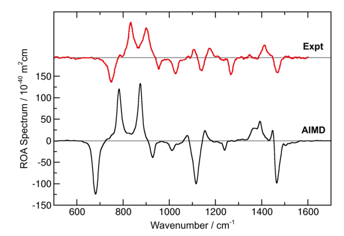

**FIG. 15.** 액체 (R)-프로필렌 옥사이드의 예측된 라만 광학 활성(ROA) 스펙트럼[138](검은색)과 실험 스펙트럼(빨간색)[140]. 이것은 문헌에서 최초로 예측된 벌크 상 ROA 스펙트럼이었습니다.

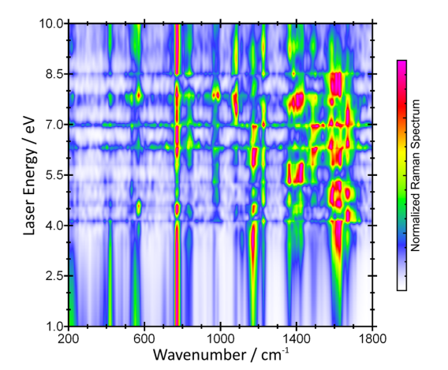

**FIG. 16.** 가능한 모든 레이저 파장(세로축)에 대한 물 속 우라실의 예측된 공명 라만 스펙트럼[144]. 행은 상대 강도 비율을 보여주기 위해 정규화되었습니다. 이것들은 문헌에서 최초로 예측된 벌크 상 공명 라만 스펙트럼이었습니다.

상 시스템이므로 전체 용매 영향과 일부 비조화 효과를 고려할 수 있습니다. 그 외에도 우리의 접근 방식은 일반화된 기울기 근사(GGA) DFT에 제한되지 않고 하이브리드 함수를 포함한 DFT와 같은 모든 실시간 전자 구조 방법과 함께 작동합니다. 우리 기사에서 우리는 물 속의 우라실을 예로 들어 문헌에서 벌크 상 공명 라만 스펙트럼의 최초 *ab initio* 예측을 제시했습니다. 우리는 또한 이 경우 용매 효과가 매우 중요하다는 것을 보여주었습니다. 전체 용매 영향이 있는 벌크 상 스펙트럼만이 실험과 잘 일치하기 때문입니다.

공명 라만 스펙트럼을 예측하기 위해 새로 개발된 방법은 특정 레이저 파장을 입력으로 요구하지 않지만 한 번의 패스로 가능한 모든 레이저 파장에 대한 전체 공명 라만 스펙트럼 세트를 산출합니다. 레이저 파장에 따른 스펙트럼은 물 속의 우라실 예제에서 **Figure 16**에 표시된 것처럼 등고선 플롯으로 시각화할 수 있습니다. 이 기능은 조사된 시스템의 진동 모드와 전자 여기 사이의 결합을 이해하는 데 도움이 될 뿐만 아니라, 흥미로운 공명 효과가 예상될 수 있는 레이저 파장을 선택하여 새로운 흥미로운 실험을 설계하는 데에도 유익합니다.

> 공명 라만(resonance Raman) 스펙트럼은 일반 라만과 동일하게 “비탄성 산란”으로 진동 모드를 관측하지만, 한 가지 결정적 차이는 레이저의 여기 파장(입사광 에너지)을 분자의 전자 전이(흡수 밴드) 근처에 맞춰 **전자–진동 결합(vibronic coupling)** 을 의도적으로 크게 만든다는 점이다. 일반 라만은 분극률(polarizability)의 변화에 의해 신호가 결정되며 대개 신호가 약한 편인데, 공명 라만은 레이저가 전자적으로 공명 조건에 가까워지면서 분극률 텐서의 주파수 의존성이 급격히 커져 특정 진동 모드의 산란 단면적이 수십~수백만 배까지 강화될 수 있다. 이 강화는 모든 모드에 균일하게 발생하는 것이 아니라, 해당 전자 전이에 직접 관여하는 좌표(즉, 전자 여기 상태에서 구조가 크게 변하는 결합/작용기)에 강하게 선택적으로 나타난다. 그래서 공명 라만은 “분자가 어디에서 전자를 흡수하는지(크로모포어), 그 전자 여기가 어떤 결합을 얼마나 변형시키는지”를 진동 모드 수준에서 매우 민감하게 추적하는 데 유리하며, 용액에서도 낮은 농도 시료를 측정할 수 있을 정도로 감도가 높다. 다만 전자 여기와 가까운 조건은 형광(background fluorescence)과 광열/광분해 위험도 함께 커지므로, 레이저 파장 선택, 출력·집광 조건, 시료 회전/흐름 셀, 저온 측정 등이 실무적으로 중요하고, 스펙트럼 해석에서는 단순한 “라만 세기”가 아니라 공명 조건에서의 모드 선택성(특정 대칭·특정 결합 중심 강화)을 전자구조/여기 상태와 연결해 읽는 것이 핵심이다.
>
> VCD(vibrational circular dichroism)와 ROA(raman optical activity)는 둘 다 “키랄성(chirality)”을 진동 스펙트럼에 직접 반영시키는 분광법으로, 구조적으로 매우 가까운 이성질체(특히 거울상 이성질체, enantiomer)를 구별하거나, 용액에서의 절대배위(absolute configuration)와 입체구조를 결정하는 데 강력하다. VCD는 적외선(IR) 흡수에서 **좌원편광(LCP)과 우원편광(RCP)** 의 흡수 차이를 측정하는 기법으로, 일반 IR이 쌍극자 모멘트 변화에 의해 흡수 강도가 정해지는 것과 달리, VCD 신호(디크로이즘)는 전기 쌍극자 전이와 자기 쌍극자/전기 사중극자 같은 항이 결합된 “키랄 응답”에서 발생한다. 그 결과 VCD는 대칭성이 깨진 3차원 배열과 결합된 진동 모드에서 양·음의 쌍극형(bisignate) 패턴이 나타날 수 있고, 무엇보다 **거울상 이성질체는 VCD 스펙트럼의 부호가 반대로** 나타난다(세기는 거의 같고 부호만 반전). 실무적으로 VCD는 보통 중적외선 영역에서 측정되며, 밴드 세기는 일반 IR보다 훨씬 작아서 높은 신호대잡음과 엄격한 베이스라인 관리가 필요하지만, DFT로 계산한 VCD(진동수/세기/부호)와 실험을 정합시키면 용액상에서의 절대구조를 매우 설득력 있게 결정할 수 있다.
>
> ROA는 라만 산란에서의 광학 활성(Optical Activity)을 이용한다는 점에서 VCD와 개념적으로 유사하지만, 측정 물리량은 “좌·우 원편광 성분의 라만 산란 강도 차” 또는 “입사·산란 편광 상태 조합에 따른 비대칭성”이다. 즉 ROA는 라만 스펙트럼 위에 얹힌 매우 작은 키랄 신호를 읽어내며, 라만이 분극률 변화에 민감한 것처럼 ROA는 분극률 텐서와 광학활성 텐서(자기-전기 혼합 응답 등)의 결합 항에 의해 결정된다. ROA는 특히 큰 유기분자, 펩타이드/단백질, 다당류처럼 용액에서 다양한 콘포머가 공존하는 시스템에서 “전체 3차원 형상과 유연성”을 반영하는 정보가 풍부하다는 평가를 받으며, 저주파(골격/집단 모드)부터 기능기 진동까지 키랄 환경에 민감한 밴드들이 나타난다. 다만 ROA 신호는 일반 라만 대비 더 약해 실험 난이도가 높고(레이저 안정성, 편광 광학계 정밀도, 형광 억제, 장시간 적산 등), 해석 역시 단순 피크 할당을 넘어 콘포메이션 앙상블을 고려한 계산(DFT/MD 기반 예측)과의 비교가 사실상 필수인 경우가 많다. 정리하면, 공명 라만은 전자 여기와 연결된 특정 진동을 “강하게 선택적으로” 증폭해 전자구조–진동 결합을 읽는 기술이고, VCD와 ROA는 각각 IR/라만에서 좌·우 원편광의 차이를 이용해 “키랄 입체구조 정보를 진동 스펙트럼으로 직접 인코딩”하여 절대구조·콘포머 분포를 강력하게 제약하는 기술이다.

## VI. 결론 (CONCLUSION)

이 기사에서 우리는 최근 TRAVIS 프로그램 패키지에 도입된 몇 가지 방법과 분석을 제시하는 동시에 이러한 분석의 효율성과 정확성에 필수적인 기본 알고리즘 중 일부를 엿볼 수 있게 했습니다. TRAVIS의 일부 기능은 수십 년 전부터 알려져 있지만, 다른 기능은 매우 최근의 것이며 개발된 직후 직접 구현되었습니다. 예를 들어, TRAVIS는 문헌에서 벌크 진동 원형 이색성(VCD) 스펙트럼[137], 벌크 상 라만 광학 활성(ROA) 스펙트럼[138], 그리고 벌크 상 공명 라만 스펙트럼[144]의 최초 *ab initio* 예측을 계산하는 데 사용되었습니다.

<!-- Page 18 -->

지난 몇 년 동안. 2011년 출시 이후, 원본 TRAVIS 논문[1]은 현재 400회 이상 인용되었으며, 800명 이상의 다른 공동 저자들이 이러한 연구에 기여했습니다. TRAVIS의 저자로서 우리는 코드에 새로운 방법과 기능을 계속 포함하는 동시에 오래되고 기존의 기능을 유지하고 문서의 품질을 개선할 것을 약속합니다.

**감사의 말 (ACKNOWLEDGMENTS)**

우리는 전 세계의 모든 TRAVIS 사용자들의 신뢰(그리고 때로는 불행히도 인내심)에 감사드립니다. M.B.는 프로젝트 번호 Br 5494/1-1을 통해 DFG로부터 재정적 지원을 받았습니다.
이 연구의 결과를 뒷받침하는 데이터는 합리적인 요청 시 교신 저자로부터 얻을 수 있습니다.

**참고문헌 (REFERENCES)**

1. M. Brehm and B. Kirchner, “TRAVIS—A free analyzer and visualizer for Monte Carlo and molecular dynamics trajectories,” J. Chem. Inf. Model. **51**(8), 2007–2023 (2011).
2. W. Humphrey, A. Dalke, K. Schulten *et al.*, “VMD: Visual molecular dynamics,” J. Mol. Graphics **14**, 33–38 (1996).
3. N. Michaud-Agrawal, E. J. Denning, T. B. Woolf, and O. Beckstein, “MDAnalysis: A toolkit for the analysis of molecular dynamics simulations,” J. Comput. Chem. **32**, 2319–2327 (2011).
4. I. T. Todorov, W. Smith, K. Trachenko, and M. T. Dove, “DL_POLY 3: New dimensions in molecular dynamics simulations via massive parallelism,” J. Mater. Chem. **16**, 1911–1918 (2006).
5. S. Plimpton, “Fast parallel algorithms for short-range molecular dynamics,” J. Comput. Phys. **117**, 1–19 (1995).
6. D. A. Case, T. E. Cheatham III, T. Darden, H. Gohlke, R. Luo, K. M. Merz, Jr., A. Onufriev, C. Simmerling, B. Wang, and R. J. Woods, “The Amber biomolecular simulation programs,” J. Comput. Chem. **26**, 1668–1688 (2005).
7. M. Brehm and M. Thomas, “An efficient lossless compression algorithm for trajectories of atom positions and volumetric data,” J. Chem. Inf. Model. **58**, 2092–2107 (2018).
8. Grace Development Team, Grace, (c), see http://plasma-gate.weizmann.ac.il/Grace, 1996–2008.
9. T. Williams, C. Kelley *et al.*, Gnuplot 4.6: An Interactive Plotting Program, http://gnuplot.sourceforge.net/ (2013).
10. Persistence of Vision Pty. Ltd., Persistence of Vision Raytracer (Version 3.6), retrieved from http://www.povray.org/download/ (2004).
11. W. R. Inc., Mathematica, Version 12.0, Champaign, IL, 2019.
12. B. Cordero, V. Gómez, A. E. Platero-Prats, M. Revés, J. Echeverría, E. Cremades, F. Barragán, and S. Alvarez, “Covalent radii revisited,” Dalton Trans. **2008**, 2832–2838 (2008).
13. R. W. Hockney and J. W. Eastwood, *Computer Simulation Using Particles* (CRC Press, 1981).
14. H. J. C. Berendsen, D. van der Spoel, and R. van Drunen, “GROMACS: A message-passing parallel molecular dynamics implementation,” Comput. Phys. Commun. **91**, 43–56 (1995).
15. C. A. Shelley and M. E. Munk, “Computer perception of topological symmetry,” J. Chem. Inf. Comput. Sci. **17**, 110–113 (1977).
16. H. L. Morgan, “The generation of a unique machine description for chemical structures: A technique developed at chemical abstracts service,” J. Chem. Doc. **5**, 107–113 (1965).
17. C. A. Shelley, “Heuristic approach for displaying chemical structures,” J. Chem. Inf. Comput. Sci. **23**, 61–65 (1983).
18. M. Brehm and M. Thomas, The BQB format, see https://brehm-research.de/bqb.
19. K. A. F. Röhrig and T. D. Kühne, “Optimal calculation of the pair correlation function for an orthorhombic system,” Phys. Rev. E **87**, 045301 (2013).
20. M. Kohagen, M. Brehm, J. Thar, W. Zhao, F. Müller-Plathe, and B. Kirchner, “Performance of quantum chemically derived charges and persistence of ion cages in ionic liquids. A molecular dynamics simulations study of 1-n-butyl-3-methylimidazolium bromide,” J. Phys. Chem. B **115**, 693–702 (2011).
21. M. Brüssel, M. Brehm, T. Voigt, and B. Kirchner, “*Ab initio* molecular dynamics simulations of a binary system of ionic liquids,” Phys. Chem. Chem. Phys. **13**, 13617–13620 (2011).
22. A. S. Pensado, M. Brehm, J. Thar, A. P. Seitsonen, and B. Kirchner, “Effect of dispersion on the structure and dynamics of the ionic liquid 1-ethyl-3-methylimidazolium thiocyanate,” ChemPhysChem **13**, 1845–1853 (2012).
23. M. Brehm, H. Weber, A. S. Pensado, A. Stark, and B. Kirchner, “Proton transfer and polarity changes in ionic liquid-water mixtures: A perspective on hydrogen bonds from *ab initio* molecular dynamics at the example of 1-ethyl-3-methylimidazolium acetate-water mixtures—Part 1,” Phys. Chem. Chem. Phys. **14**, 5030–5044 (2012).
24. M. Brehm, H. Weber, A. S. Pensado, A. Stark, and B. Kirchner, “Liquid structure and cluster formation in ionic liquid/water mixtures—An extensive *ab initio* molecular dynamics study on 1-ethyl-3-methylimidazolium acetate/water mixtures—Part 2,” Z. Phys. Chem. **227**, 177–204 (2013).
25. F. Malberg, M. Brehm, O. Hollóczki, A. S. Pensado, and B. Kirchner, “Understanding the evaporation of ionic liquids using the example of 1-ethyl-3-methylimidazolium ethylsulfate,” Phys. Chem. Chem. Phys. **15**, 18424–18436 (2013).
26. M. Thomas, M. Brehm, O. Hollóczki, and B. Kirchner, “How can a carbene be active in an ionic liquid?,” Chem. - Eur. J. **20**, 1622–1629 (2014).
27. O. Hollóczki, M. Macchiagodena, H. Weber, M. Thomas, M. Brehm, A. Stark, O. Russina, A. Triolo, and B. Kirchner, “Triphilic ionic-liquid mixtures: Fluorinated and non-fluorinated aprotic ionic-liquid mixtures,” ChemPhysChem **16**, 3325–3333 (2015).
28. M. Brehm, H. Weber, M. Thomas, O. Hollóczki, and B. Kirchner, “Domain analysis in nanostructured liquids: A post-molecular dynamics study at the example of ionic liquids,” ChemPhysChem **16**, 3271–3277 (2015).
29. M. Brehm, G. Saddiq, T. Watermann, and D. Sebastiani, “Influence of small fluorophilic and lipophilic organic molecules on dipalmitoylphosphatidylcholine bilayers,” J. Phys. Chem. B **121**, 8311–8321 (2017).
30. S. Gehrke, M. von Domaros, R. Clark, O. Hollóczki, M. Brehm, T. Welton, A. Luzar, and B. Kirchner, “Structure and lifetimes in ionic liquids and their mixtures,” Faraday Discuss. **206**, 219–245 (2018).
31. S. Pylaeva, M. Brehm, and D. Sebastiani, “Salt bridge in aqueous solution: Strong structural motifs but weak enthalpic effect,” Sci. Rep. **8**, 13626 (2018).
32. M. Brehm, M. Pulst, J. Kressler, and D. Sebastiani, “Triazolium-based ionic liquids: A novel class of cellulose solvents,” J. Phys. Chem. B **123**, 3994–4003 (2019).
33. M. Brüssel, M. Brehm, A. S. Pensado, F. Malberg, M. Ramzan, A. Stark, and B. Kirchner, “On the ideality of binary mixtures of ionic liquids,” Phys. Chem. Chem. Phys. **14**, 13204–13215 (2012).
34. A. Korotkevich, D. S. Firaha, A. A. H. Padua, and B. Kirchner, “*Ab initio* molecular dynamics simulations of SO$_2$ solvation in choline chloride/glycerol deep eutectic solvent,” Fluid Phase Equilib. **448**, 59–68 (2017).
35. S. Zahn, “Deep eutectic solvents: Similia similibus solvuntur?,” Phys. Chem. Chem. Phys. **19** (5), 4041–4047 (2017).
36. L. Gontrani, F. Trequattrini, O. Palumbo, L. Bencivenni, and A. Paolone, “New experimental evidences regarding conformational equilibrium in ammonium−bis(trifluoromethanesulfonyl)imide ionic liquids,” ChemPhysChem **19**(20), 2776–2781 (2018).
37. M. Brehm and D. Sebastiani, “Simulating structure and dynamics in small droplets of 1-ethyl-3-methylimidazolium acetate,” J. Chem. Phys. **148**, 193802 (2018).
38. L. M. Lawson Daku, “Spin-state dependence of the structural and vibrational properties of solvated iron(II) polypyridyl complexes from AIMD simulations: II. Aqueous [Fe(TPy)$_2$]Cl$_2$,” Phys. Chem. Chem. Phys. **21**(2), 650–661 (2019).
39. J. Thar, M. Brehm, A. P. Seitsonen, and B. Kirchner, “Unexpected hydrogen bond dynamics in imidazolium-based ionic liquids,” J. Phys. Chem. B **113**, 15129–15132 (2009).

<!-- Page 19 -->

40. M. Kohagen, M. Brehm, Y. Lingscheid, R. Giernoth, J. Sangoro, F. Kremer, S. Naumov, C. Iacob, J. Kärger, R. Valiullin, and B. Kirchner, “How hydrogen bonds influence the mobility of imidazolium-based ionic liquids. A combined theoretical and experimental study of 1-N-butyl-3-methylimidazolium bromide,” J. Phys. Chem. B **115**, 15280–15288 (2011).
41. K. Wendler, M. Brehm, F. Malberg, B. Kirchner, and L. Delle Site, “Short time dynamics of ionic liquids in AIMD-based power spectra,” J. Chem. Theory Comput. **8**, 1570–1579 (2012).
42. O. Hollóczki, D. S. Firaha, J. Friedrich, M. Brehm, R. Cybik, M. Wild, A. Stark, and B. Kirchner, “Carbene formation in ionic liquids: Spontaneous, induced, or prohibited?,” J. Phys. Chem. B **117**, 5898–5907 (2013).
43. G. Bekçioğlu, C. Allolio, and D. Sebastiani, “Water wires in aqueous solutions from first-principles calculations,” J. Phys. Chem. B **119**, 4053–4060 (2015).
44. M. L. S. Batista, G. Pérez-Sánchez, J. R. B. Gomes, J. A. P. Coutinho, and E. J. Maginn, “Evaluation of the GROMOS 56ACARBO force field for the calculation of structural, volumetric, and dynamic properties of aqueous glucose systems,” J. Phys. Chem. B **119**, 15310–15319 (2015).
45. Q. R. Sheridan, S. Oh, O. Morales-Collazo, E. W. Castner, J. F. Brennecke, and E. J. Maginn, “Liquid structure of CO$_2$-reactive aprotic heterocyclic anion ionic liquids from X-ray scattering and molecular dynamics,” J. Phys. Chem. B **120**, 11951–11960 (2016).
46. F. Lo Celso, G. B. Appetecchi, C. J. Jafta, L. Gontrani, J. N. Canongia Lopes, A. Triolo, and O. Russina, “Nanoscale organization in the fluorinated room temperature ionic liquid: Tetraethyl ammonium (trifluoromethanesulfonyl)(nonafluorobutylsulfonyl)imide,” J. Chem. Phys. **148**, 193816 (2018).
47. K. Bernardino, T. A. Lima, and M. C. C. Ribeiro, “Low-temperature phase transitions of the ionic liquid 1-ethyl-3-methylimidazolium dicyanamide,” J. Phys. Chem. B **123**(44), 9418–9427 (2019).
48. M. Zhao, B. Wu, S. I. Lall-Ramnarine, J. D. Ramdihal, K. A. Papacostas, E. D. Fernandez, R. A. Sumner, C. J. Margulis, J. F. Wishart, and E. W. Castner, “Structural analysis of ionic liquids with symmetric and asymmetric fluorinated anions,” J. Chem. Phys. **151**, 074504 (2019).
49. X.-Y. Guo, C. Peschel, T. Watermann, G. F. v. Rudorff, and D. Sebastiani, “Cluster formation of polyphilic molecules solvated in a DPPC bilayer,” Polymers **9**, 488 (2017).
50. M. H. Dokoohaki, A. R. Zolghadr, and A. Klein, “Impact of the chemical structure on the distribution of neuroprotective *N*-alkyl-9H-carbazoles at octanol/water interfaces,” New J. Chem. **44**(4), 1211–1220 (2020).
51. L. K. Scarbath-Evers, R. Hammer, D. Golze, M. Brehm, D. Sebastiani, and W. Widdra, “From flat to tilted: Gradual interfaces in organic thin film growth,” Nanoscale **12**, 3834–3845 (2020).
52. O. Russina, F. L. Celso, and A. Triolo, “Pressure-responsive mesoscopic structures in room temperature ionic liquids,” Phys. Chem. Chem. Phys. **17**, 29496–29500 (2015).
53. T. C. Lourenço, Y. Zhang, L. T. Costa, and E. J. Maginn, “A molecular dynamics study of lithium-containing aprotic heterocyclic ionic liquid electrolytes,” J. Chem. Phys. **148**, 193834 (2018).
54. F. Lo Celso, G. B. Appetecchi, E. Simonetti, M. Zhao, E. W. Castner, U. Keiderling, L. Gontrani, A. Triolo, and O. Russina, “Microscopic structural and dynamic features in triphilic room temperature ionic liquids,” Front. Chem. **7**, 285 (2019).
55. M. Macchiagodena, G. Mancini, M. Pagliai, G. Cardini, and V. Barone, “New atomistic model of pyrrole with improved liquid state properties and structure,” Int. J. Quantum Chem. **118**(9), e25554 (2018).
56. V. F. Sears, “Neutron scattering lengths and cross sections,” Neutron News **3**, 26–37 (1992).
57. E. Lorch, “Neutron diffraction by germania, silica and radiation-damaged silica glasses,” J. Phys. C: Solid State Phys. **2**, 229–237 (1969).
58. F. L. Celso, B. Aoun, A. Triolo, and O. Russina, “Liquid structure of dibutyl sulfoxide,” Phys. Chem. Chem. Phys. **18**(23), 15980–15987 (2016).
59. M. Campetella, M. Montagna, L. Gontrani, E. Scarpellini, and E. Bodo, “Unexpected proton mobility in the bulk phase of cholinium-based ionic liquids: New insights from theoretical calculations,” Phys. Chem. Chem. Phys. **19**, 11869–11880 (2017).
60. U. Kapoor and J. K. Shah, “Globular, sponge-like to layer-like morphological transition in 1-n-alkyl-3-methylimidazolium octylsulfate ionic liquid homologous series,” J. Phys. Chem. B **122**, 213–228 (2018).
61. M. Campetella, A. Mariani, C. Sadun, B. Wu, E. W. Castner, and L. Gontrani, “Structure and dynamics of propylammonium nitrate-acetonitrile mixtures: An intricate multi-scale system probed with experimental and theoretical techniques,” J. Chem. Phys. **148**(13), 134507 (2018).
62. F. L. Celso, Y. Yoshida, R. Lombardo, C. J. Jafta, L. Gontrani, A. Triolo, and O. Russina, “Mesoscopic structural organization in fluorinated room temperature ionic liquids,” C. R. Chim. **21**(8), 757–770 (2018).
63. L. S. Vermeer, B. L. de Groot, V. Réat, A. Milon, and J. Czaplicki, “Acyl chain order parameter profiles in phospholipid bilayers: Computation from molecular dynamics simulations and comparison with 2H NMR experiments,” Eur. Biophys. J. **36**, 919–931 (2007).
64. R. Giernoth, A. Bröhl, M. Brehm, and Y. Lingscheid, “Interactions in ionic liquids probed by in situ NMR spectroscopy,” J. Mol. Liq. **192**, 55–58 (2014).
65. A. B. W. Kennedy and H. R. Sankey, “The thermal efficiency of steam engines. Report of the committee appointed to the council upon the subject of the definition of a standard or standards of thermal efficiency for steam engines: With an introductory note. (Including appendixes and plate at back of volume),” Minutes Proc. Inst. Civil Eng. **134**, 278–312 (1898).
66. J. D. Hunter, “Matplotlib: A 2D graphics environment,” Comput. Sci. Eng. **9**, 90–95 (2007).
67. G. Voronoi, “Nouvelles applications des paramètres continus à la théorie des formes quadratiques. Deuxième mémoire. Recherches sur les parallélloèdres primitifs,” J. Reine Angew. Math. **1908**(134), 198 (1908).
68. C. H. Rycroft, “Voro++: A three-dimensional Voronoi cell library in C++,” Chaos **19**, 041111 (2009).
69. C. H. Rycroft, G. S. Grest, J. W. Landry, and M. Z. Bazant, “Analysis of granular flow in a pebble-bed nuclear reactor,” Phys. Rev. E **74**, 021306 (2006).
70. B. J. Gellatly and J. L. Finney, “Calculation of protein volumes: An alternative to the Voronoi procedure,” J. Mol. Biol. **161**, 305–322 (1982).
71. F. M. Richards, “The interpretation of protein structures: Total volume, group volume distributions and packing density,” J. Mol. Biol. **82**, 1–14 (1974).
72. D. S. Firaha, M. Kavalchuk, and B. Kirchner, “SO$_2$ solvation in the 1-ethyl-3-methylimidazolium thiocyanate ionic liquid by incorporation into the extended cation–anion network,” J. Solution Chem. **44**, 838–849 (2015).
73. T. D. N. Reddy and B. S. Mallik, “Heterogeneity in the microstructure and dynamics of tetraalkylammonium hydroxide ionic liquids: Insight from classical molecular dynamics simulations and Voronoi tessellation analysis,” Phys. Chem. Chem. Phys. **22**(6), 3466–3480 (2020).
74. A. Mariani, R. Caminiti, M. Campetella, and L. Gontrani, “Pressure-induced mesoscopic disorder in protic ionic liquids: First computational study,” Phys. Chem. Phys. **18** (4), 2297–2302 (2016).
75. D. O. Abranches, N. Schaeffer, L. P. Silva, M. A. R. Martins, S. P. Pinho, and J. A. P. Coutinho, “The role of charge transfer in the formation of type I deep eutectic solvent-analogous ionic liquid mixtures,” Molecules **24**(20), 3687 (2019).
76. T. Cosby, U. Kapoor, J. K. Shah, and J. Sangoro, “Mesoscale organization and dynamics in binary ionic liquid mixtures,” J. Phys. Chem. Lett. **10**(20), 6274–6280 (2019).
77. R. Macchieraldo, S. Gehrke, N. K. Batchu, B. Kirchner, and K. Binnemans, “Tuning solvent miscibility: A fundamental assessment at the example of induced methanol/n-dodecane phase separation,” J. Phys. Chem. B **123**, 4400–4407 (2019).
78. T. D. N. Reddy and B. S. Mallik, “Nanostructure domains, voids, and low-frequency spectra in binary mixtures of N,N-dimethylacetamide and ionic liquids with varying cationic size,” RSC Adv. **10**(3), 1811–1827 (2020).
79. S. Gehrke, R. Macchieraldo, and B. Kirchner, “Understanding the fluidity of condensed phase systems in terms of voids—Novel algorithm, implementation and application,” Phys. Chem. Chem. Phys. **21**, 4988–4997 (2019).
80. X. Huang, C. J. Margulis, Y. Li, and B. J. Berne, “Why is the partial molar volume of CO$_2$ so small when dissolved in a room temperature ionic liquid? Structure and dynamics of CO$_2$ dissolved in [BMIm$^+$][PF$_6^-$],” J. Am. Chem. Soc. **127**, 17842–17851 (2005).

<!-- Page 20 -->

81. N. N. Medvedev, V. P. Voloshin, V. A. Luchnikov, and M. L. Gavrilova, “An algorithm for three-dimensional Voronoi S-network,” J. Comput. Chem. **27**, 1676–1692 (2006).
82. J. Ingenmey, S. Gehrke, and B. Kirchner, “How to harvest Grotthuss diffusion in protic ionic liquid electrolyte systems,” ChemSusChem **11**, 1900–1910 (2018).
83. A. Einstein, “Über die von der molekularkinetischen theorie der wärme geforderte bewegung von in ruhenden flüssigkeiten suspendierten teilchen,” Ann. Phys. **322**, 549–560 (1905).
84. V. Calandrini, E. Pellegrini, P. Calligari, K. Hinsen, and G. R. Kneller, “nMoldyn—Interfacing spectroscopic experiments, molecular dynamics simulations and models for time correlation functions,” École Thématique Soc. Française Neutronique **12**, 201–232 (2011).
85. R. Stefanovic, G. B. Webber, and A. J. Page, “Nanostructure of propylammonium nitrate in the presence of poly(ethylene oxide) and halide salts,” J. Chem. Phys. **148**(19), 193826 (2018).
86. U. Cerajewski, J. Träger, S. Henkel, A. H. Roos, M. Brehm, and D. Hinderberger, “Nanoscopic structures and molecular interactions leading to a dystectic and two eutectic points in [EMIm][Cl]/urea mixtures,” Phys. Chem. Chem. Phys. **20**, 29591–29600 (2018).
87. H. Scheiber, Y. Shi, and R. Z. Khaliullin, “Communication: Compact orbitals enable low-cost linear-scaling *ab initio* molecular dynamics for weakly-interacting systems,” J. Chem. Phys. **148**(23), 231103 (2018).
88. M. S. Green, “Markoff random processes and the statistical mechanics of time-dependent phenomena. II. Irreversible processes in fluids,” J. Chem. Phys. **22**, 398–413 (1954).
89. J. Wuttke, LMFIT—A C Library for Levenberg-Marquardt Least-Squares Minimization and Curve Fitting, based on work by B. S. Garbow, K. E. Hillstrom, J. J. Moré, and S. Moshier, retrieved in 2010 from https://jugit.fz-juelich.de/mlz/lmfit.
90. M. Macchiagodena, G. D. Frate, G. Brancato, B. Chandramouli, G. Mancini, and V. Barone, “Computational study of the DPAP molecular rotor in various environments: From force field development to molecular dynamics simulations and spectroscopic calculations,” Phys. Chem. Chem. Phys. **19**(45), 30590–30602 (2017).
91. M. H. Kowsari and S. Ebrahimi, “Capturing the effect of [PF$_3$(C$_2$F$_5$)$_3$]$^-$ vs. [PF$_6$]$^-$, flexible anion vs. rigid, and scaled charge vs. unit on the transport properties of [BMIm]$^+$-based ionic liquids: A comparative MD study,” Phys. Chem. Chem. Phys. **20** (19), 13379–13393 (2018).
92. C. Dreßler and D. Sebastiani, “Effect of anion reorientation on proton mobility in the solid acids family CsH$_y$XO$_4$ (X = S, P, Se, y = 1, 2) from *ab initio* molecular dynamics simulations,” Phys. Chem. Chem. Phys. (published online 2019).
93. F. Stillinger, “Theoretical approaches to the intermolecular nature of water,” Philos. Trans. R. Soc., B **278**, 97–112 (1977).
94. D. C. Rapaport, “Hydrogen bonds in water: Network organization and lifetimes,” Mol. Phys. **50**, 1151–1162 (1983).
95. A. Khintchine, “Korrelationstheorie der stationären stochastischen prozesse,” Math. Ann. **109**(1), 604–615 (1934).
96. A. Luzar and D. Chandler, “Effect of environment on hydrogen bond dynamics in liquid water,” Phys. Rev. Lett. **76**, 928 (1996).
97. A. Luzar and D. Chandler, “Hydrogen-bond kinetics in liquid water,” Nature **379**, 55 (1996).
98. A. Luzar, “Resolving the hydrogen bond dynamics conundrum,” J. Chem. Phys. **113**, 10663–10675 (2000).
99. S. Gehrke and B. Kirchner, “Robustness of the hydrogen bond and ion pair dynamics in ionic liquids to different parameters from the reactive flux method,” J. Chem. Eng. Data **65**, 1146–1158 (2019).
100. S. Ghahramani, F. Yousefi, S. M. Hosseini, and S. Aparicio, “High-pressure behavior of 2-hydroxyethylammonium acetate ionic liquid: Experiment and molecular dynamics,” J. Supercrit. Fluids **155**, 104664 (2020).
101. S. Gehrke and O. Hollóczki, “Hydrogen bonding of *N*-heterocyclic carbenes in solution: Mechanisms of solvent reorganization,” Chem. - Eur. J. **24**, 11594–11604 (2018).
102. T. Stettner, S. Gehrke, P. Ray, B. Kirchner, and A. Balducci, “Water in protic ionic liquids: Properties and use of a novel class of electrolytes for energy storage devices,” ChemSusChem **12**, 3827–3836 (2019).
103. L. Van Hove, “Correlations in space and time and Born approximation scattering in systems of interacting particles,” Phys. Rev. **95**, 249–262 (1954).
104. R. G. Gordon, “Molecular motion in infrared and Raman spectra,” J. Chem. Phys. **43**, 1307–1312 (1965).
105. M. Thomas, “Theoretical modeling of vibrational spectra in the liquid phase,” Springer theses, Springer International Publishing, 2016.
106. J. Hutter, M. Iannuzzi, F. Schiffmann, and J. VandeVondele, “CP2K: Atomistic simulations of condensed matter systems,” Wiley Interdiscip. Rev.: Comput. Mol. Sci. **4**, 15–25 (2014).
107. M. Brehm and M. Thomas, Tutorial on Computing Vibrational Spectra, see https://brehm-research.de/spectroscopy.
108. M. Borgerding, KISS FFT Library, see http://sourceforge.net/projects/kissfft/.
109. P. Kahlig, “Some aspects of Julius Von Hann’s contribution to modern climatology,” in *Interactions Between Global Climate Subsystems* (American Geophysical Union, 2013), pp. 1–7.
110. L. Verlet, “Computer “experiments” on classical fluids. I. Thermodynamical properties of Lennard–Jones molecules,” Phys. Rev. **159**, 98–103 (1967).
111. G. H. Wannier, “The structure of electronic excitation levels in insulating crystals,” Phys. Rev. **52**, 191–197 (1937).
112. N. Marzari and D. Vanderbilt, “Maximally localized generalized Wannier functions for composite energy bands,” Phys. Rev. B **56**, 12847–12865 (1997).
113. M. Thomas, M. Brehm, and B. Kirchner, “Voronoi dipole moments for the simulation of bulk phase vibrational spectra,” Phys. Chem. Chem. Phys. **17**, 3207–3213 (2015).
114. M. Mantina, A. C. Chamberlin, R. Valero, C. J. Cramer, and D. G. Truhlar, “Consistent van der Waals radii for the whole main group,” J. Phys. Chem. A **113**, 5806–5812 (2009).
115. M. Thomas, M. Brehm, O. Hollóczki, Z. Kelemen, L. Nyulászi, T. Pasinszki, and B. Kirchner, “Simulating the vibrational spectra of ionic liquid systems: 1-ethyl-3-methylimidazolium acetate and its mixtures,” J. Chem. Phys. **141**, 024510 (2014).
116. M. C. Kirkegaard, J. L. Niedziela, A. Miskowiec, A. E. Shields, and B. B. Anderson, “Elucidation of the structure and vibrational spectroscopy of synthetic metaschoepite and its dehydration product,” Inorg. Chem. **58**(11), 7310–7323 (2019).
117. T. Bauer, S. Maisel, D. Blaumeiser, J. Vecchietti, N. Taccardi, P. Wasserscheid, A. Bonivardi, A. Görling, and J. Libuda, “Operando drifts and DFT study of propane dehydrogenation over solid- and liquid-supported GaxPty catalysts,” ACS Catal. **9**(4), 2842–2853 (2019).
118. G. Mathias and M. D. Baer, “Generalized normal coordinates for the vibrational analysis of molecular dynamics simulations,” J. Chem. Theory Comput. **7**, 2028–2039 (2011).
119. G. Mathias, S. D. Ivanov, A. Witt, M. D. Baer, and D. Marx, “Infrared spectroscopy of fluxional molecules from (*ab initio*) molecular dynamics: Resolving large-amplitude motion, multiple conformations, and permutational symmetries,” J. Chem. Theory Comput. **8**, 224–234 (2012).
120. B. Koeppe, S. A. Pylaeva, C. Allolio, D. Sebastiani, E. T. J. Nibbering, G. S. Denisov, H.-H. Limbach, and P. M. Tolstoy, “Polar solvent fluctuations drive proton transfer in hydrogen bonded complexes of carboxylic acid with pyridines: NMR, IR and *ab initio* MD study,” Phys. Chem. Chem. Phys. **19**(2), 1010–1028 (2017).
121. M. Gług, M. Z. Brela, M. Boczar, A. M. Turek, Ł. Boda, M. J. Wójcik, T. Nakajima, and Y. Ozaki, “Infrared spectroscopy and Born–Oppenheimer molecular dynamics simulation study on deuterium substitution in the crystalline benzoic acid,” J. Phys. Chem. B **121**(3), 479–489 (2017).
122. L. M. Lawson Daku, “Spin-state dependence of the structural and vibrational properties of solvated iron(II) polypyridyl complexes from AIMD simulations: Aqueous [Fe(bpy)$_3$]Cl$_2$, a case study,” Phys. Chem. Chem. Phys. **20**, 6236–6253 (2018).
123. P. L. Silvestrelli, M. Bernasconi, and M. Parrinello, “*Ab initio* infrared spectrum of liquid water,” Chem. Phys. Lett. **277**, 478–482 (1997).
124. M. P. Gaigeot, R. Vuilleumier, M. Sprik, and D. Borgis, “Infrared spectroscopy of *N*-methylacetamide revisited by *ab initio* molecular dynamics simulations,” J. Chem. Theory Comput. **1**, 772–789 (2005).

<!-- Page 21 -->

125. M.-P. Gaigeot, M. Martinez, and R. Vuilleumier, “Infrared spectroscopy in the gas and liquid phase from first principle molecular dynamics simulations: Application to small peptides,” Mol. Phys. **105**, 2857–2878 (2007).
126. M.-P. Gaigeot, N. A. Besley, and J. D. Hirst, “Modeling the infrared and circular dichroism spectroscopy of a bridged cyclic diamide,” J. Phys. Chem. B **115**, 5526–5535 (2011).
127. A. Putrino and M. Parrinello, “Anharmonic Raman spectra in high-pressure ice from *ab initio* simulations,” Phys. Rev. Lett. **88**, 176401 (2002).
128. M. Thomas, M. Brehm, R. Fligg, P. Vöhringer, and B. Kirchner, “Computing vibrational spectra from *ab initio* molecular dynamics,” Phys. Chem. Chem. Phys. **15**, 6608–6622 (2013).
129. M. Etinski and B. Ensing, “Puzzle of the intramolecular hydrogen bond of dibenzoylmethane resolved by molecular dynamics simulations,” J. Phys. Chem. A **122**(28), 5945–5954 (2018).
130. E. O. Fetisov, D. B. Harwood, I.-F. W. Kuo, S. E. E. Warrag, M. C. Kroon, C. J. Peters, and J. I. Siepmann, “First-principles molecular dynamics study of a deep eutectic solvent: Choline chloride/urea and its mixture with water,” J. Phys. Chem. B **122**(3), 1245–1254 (2018).
131. M. T. Ruggiero, J. Kölbel, Q. Li, and J. A. Zeitler, “Predicting the structures and associated phase transition mechanisms in disordered crystals via a combination of experimental and theoretical methods,” Faraday Discuss. **211**, 425–439 (2018).
132. G. Cassone, J. Sponer, S. Trusso, and F. Saija, “*Ab initio* spectroscopy of water under electric fields,” Phys. Chem. Chem. Phys. **21**(38), 21205–21212 (2019).
133. B. Dutta and J. Chowdhury, “Existence of dimeric hydroxylamine-O-sulfonic acid: Experimental observations aided by *ab initio*, DFT, Car–Parrinello and Born–Oppenheimer on the fly dynamics,” Chem. Phys. Lett. **732**, 136645 (2019).
134. H. Hoshina, T. Kanemura, and M. T. Ruggiero, “Exploring the dynamics of bound water in nylon polymers with terahertz spectroscopy,” J. Phys. Chem. B **124**(2), 422–429 (2020).
135. A. Scherrer, R. Vuilleumier, and D. Sebastiani, “Nuclear velocity perturbation theory of vibrational circular dichroism,” J. Chem. Theory Comput. **9**, 5305–5312 (2013).
136. A. Scherrer, R. Vuilleumier, and D. Sebastiani, “Vibrational circular dichroism from *ab initio* molecular dynamics and nuclear velocity perturbation theory in the liquid phase,” J. Chem. Phys. **145**, 084101 (2016).
137. M. Thomas and B. Kirchner, “Classical magnetic dipole moments for the simulation of vibrational circular dichroism by *ab initio* molecular dynamics,” J. Phys. Chem. Lett. **7**, 509–513 (2016).
138. M. Brehm and M. Thomas, “Computing bulk phase Raman optical activity spectra from *ab initio* molecular dynamics simulations,” J. Phys. Chem. Lett. **8**, 3409–3414 (2017).
139. D. A. Long, *The Raman Effect: A Unified Treatment of the Theory of Raman Scattering by Molecules* (John Wiley & Sons Ltd., 2002).
140. J. Šebestík and P. Bouř, “Raman optical activity of methyloxirane gas and liquid,” J. Phys. Chem. Lett. **2**, 498–502 (2011).
141. H. Chen, J. M. Mcmahon, M. A. Ratner, and G. C. Schatz, “Classical electrodynamics coupled to quantum mechanics for calculation of molecular optical properties: A RT-TDDFT/FDTD approach,” J. Phys. Chem. C **114**, 14384–14392 (2010).
142. M. Thomas, F. Latorre, and P. Marquetand, “Resonance Raman spectra of ortho-nitrophenol calculated by real-time time-dependent density functional theory,” J. Chem. Phys. **138**, 044101 (2013).
143. J. Mattiat and S. Luber, “Efficient calculation of (resonance) Raman spectra and excitation profiles with real-time propagation,” J. Chem. Phys. **149**, 174108 (2018).
144. M. Brehm and M. Thomas, “Computing bulk phase resonance Raman spectra from *ab initio* molecular dynamics and real-time TDDFT,” J. Chem. Theory Comput. **15**, 3901–3905 (2019).
