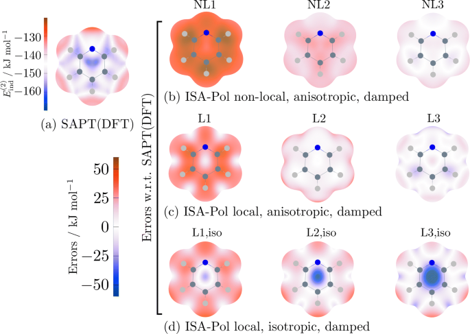

## 1. 한 줄 요약 / 키 메시지
ISA-Pol은 **Iterated Stockholder Atoms(ISA)** 개념을 **basis-space(BS)** 구현으로 확장하여, 분자 내 원자들의 **분산된 주파수 의존 분극률(distributed frequency-dependent polarizabilities)**과 **분산(Dispersion) 모델**을 안정적이고 수렴성 있게 추출할 수 있는 새로운 접근법을 제시한다. 이 방법은 향후 **SAPT 기반 물리적 Force Field의 차세대 분극/분산 항 모델링**의 표준이 될 수 있다.

---

## 2. 배경 및 문제의식
기존의 다중극자 및 분극률 분배(distribution) 접근은 기저함수 선택이나 분자 환경에 따라 불안정하게 수렴하며, 물리적으로 일관된 전이성(transferability)을 확보하기 어려웠다.
Misquitta와 Stone은 이러한 문제를 해결하기 위해 **ISA (Iterated Stockholder Atoms)** 기반으로 **원자 수준의 전자밀도 분배를 물리적으로 정의**하고, 이를 통해 **분산 다중극자(distributed multipoles)** 및 **분산 분극률(distributed polarizabilities)**을 체계적으로 산출하는 방법론을 개발했다.

---

## 3. 핵심 개념 및 방법론

### 3.0 ISA란?
**ISA**는 *Iterated Stockholder Atoms*의 약자다.
한 문장으로 말하면, **분자 전체의 전자밀도(전자구름)를 “원자별 전자밀도”로 물리적으로 그럴듯하게 분할(partition)하는 방법**이다.

---

#### 왜 ISA가 필요한가?

SAPT/DFT-SAPT 기반 힘장이나 물리 기반 FF에서는 최종적으로
- 원자(혹은 결합/오프-원자 사이트) 단위의 **다중극자(multipoles)**
- 원자 단위의 **분극률(polarizability)**
- 원자 단위의 **분산(Dispersion) 모델 파라미터**

같은 **원자 수준 파라미터**가 필요하다.
그런데 양자화학 계산이 주는 기본 결과는 보통 “분자 전체”의 전자밀도 ρ(r)라서, 이를 **원자별로 나누는 규칙(분배/분할 스킴)**이 있어야 한다.
ISA는 이 “원자 분할”을 안정적이고 전이성 있게 하려는 목적에서 나온 방법이다.

---

## ISA의 핵심 아이디어(Stockholder 분할)

분자의 전자밀도 ρ(r)를 원자 A들의 기여 ρ_A(r) 합으로 쪼개고 싶다:

ρ(r) ≈ Σ_A ρ_A(r)

ISA는 각 점 r에서 전자밀도를 원자들에게 “지분(share)”처럼 배분한다.
원자 A의 지분율은 **원자 shape function** w_A(r)에 의해 결정된다:

- 각 원자 A에 대해 w_A(r)를 정의한다(원자 전자구름의 “모양” 역할).
- 점 r에서 원자 A가 가져갈 비율은

p_A(r) = w_A(r) / Σ_B w_B(r)

- 그래서 원자 A의 전자밀도는

ρ_A(r) = p_A(r) · ρ(r)

즉, **전체 밀도 ρ(r)를 shape function들의 상대 비율로 나눠 갖는 방식**이다.

---

#### “Iterated(반복)”가 붙는 이유

문제는 w_A(r)를 처음부터 완벽히 알 수 없다는 점이다.
ISA는 다음을 반복(iterate)한다:

1) 초기 w_A(r) (대충의 원자 형태)로 p_A(r)을 계산
2) ρ_A(r)를 얻음
3) ρ_A(r)로부터 더 “원자다운” w_A(r)를 다시 업데이트
4) 수렴할 때까지 반복

그래서 이름이 **Iterated Stockholder Atoms**다.

---

#### ISA를 쓰면 뭐가 좋아지나?

- **분산 다중극자(distributed multipoles)**가 더 잘 수렴하고 일관되게 나온다.
- “어떤 분자 환경/기저집합에서 계산했는지”에 덜 흔들리는 경향이 있다.
- 전자밀도 기반이라 화학적 변화(치환/극성 변화)에 비교적 자연스럽게 반응한다.
- 결과적으로, ISA 기반의 분배는 **전이성(transferability)** 있는 원자 파라미터를 만들 때 유리하다.

---

#### ISA-Pol과의 연결

**ISA-Pol**은 ISA(특히 BS-ISA 같은 안정적 구현)를 기반으로,
- 원자별 **주파수 의존 분극률(distributed frequency-dependent polarizability)**
- 그로부터 **분산(Dispersion) 모델**

을 구성하려는 방법이다.
즉, ISA는 “원자 정의/분할의 기반”, ISA-Pol은 “그 기반 위에서 분극·분산 모델까지 확장”이라고 보면 된다.

### 3.1 BS-ISA (Basis-Space ISA)
- 기존 실공간(real-space) ISA의 수렴 문제를 해결하기 위해, **basis-space(기저 공간)** 내에서 전자밀도 분배를 수행한다.
- 이를 통해 **잘 정의된 기저 집합 한계(basis set limit)**를 가지며, 수렴이 빠르고 안정적이다.
- 결과적으로 얻어진 **분산 다중극자 전개(distributed multipole expansion)**는 기존 방법보다 훨씬 빠르게 수렴하며, 물리적으로 해석 가능하다.

### 3.2 ISA-Pol
- BS-ISA를 기반으로 **주파수 의존 분극률(frequency-dependent polarizabilities)**을 원자 단위로 분배하는 절차.
- LMO(Local Molecular Orbital) 또는 분자 응답 계산과 결합하여 **분자 전체의 분극 응답을 원자 수준으로 매핑**.
- 분산(Dispersion) 에너지를 계산할 때 필요한 **비국소(non-local) 상호작용 기여**를 정확하게 재현한다.

### 3.3 Dispersion Model
- ISA-Pol로부터 추출된 분산 모델은
  ① **정확한 분산 에너지 재현**,
  ② **기저 세트 의존성 제거**,
  ③ **화학/물리적 환경 변화에 대한 자연스러운 반응성**을 동시에 만족한다.
- 이 모델은 **일반적으로 사용되는 조합 규칙(combination rules)**을 높은 정확도로 자동 충족한다는 점에서 주목받는다.

---

## 4. 주요 결과 및 검증
- ISA-Pol은 다양한 분자 시스템에서 **SAPT 분산 에너지와 탁월한 일치**를 보였다.
- 특히 **전이성(transferability)**과 **화학 환경 반응성** 측면에서 기존 Distributed Polarizability 모델보다 우수함이 입증되었다.
- 모델은 다중극자 차수 증가에 따른 수렴성을 명확히 보이며, 이는 고정된 파라미터가 아닌 **물리적 응답 기반 모델**임을 강조한다.

---

## 5. 본 연구와의 연계성
- IL–MOF 및 IL–Oligomer 시스템의 **분극/분산 상호작용을 SAPT 기반으로 정밀하게 모델링**하기 위해서는
  ISA-Pol과 같은 **전이 가능한 분극률 분배 스킴**이 필수적이다.
- 특히 ionic liquid 내 **BMIM+, TFSI−** 같은 비등방성(anisotropic) 이온–π 또는 이온–전자 구름 상호작용을 기술할 때,
  **ISA-Pol의 anisotropic distributed polarizability**는 유효한 파라미터화 접근을 제공할 수 있다.

---

## 6. 요약 및 중요성
| 구분 | 내용 |
|------|------|
| 주요 혁신 | BS-ISA 기반의 안정적 분산 분극률 및 분산 모델 생성 |
| 핵심 성과 | 기저 집합 독립성 확보, 정확한 분산 에너지 재현 |
| 응용 가능성 | 차세대 ab initio force field의 분극/분산 항 구축 |
| 본 연구와의 연결 | MOF–IL 시스템의 전이 가능한 SAPT 기반 힘장 구성 핵심 모듈 |

---

## 7. 인용
Misquitta, A. J.; Stone, A. J. **ISA-Pol: Distributed Polarizabilities and Dispersion Models from a Basis-Space Implementation of the Iterated Stockholder Atoms Procedure.**
*Theor. Chem. Acc.* **137**, 153 (2018). DOI: [10.1007/s00214-018-2302-4](https://doi.org/10.1007/s00214-018-2302-4)
